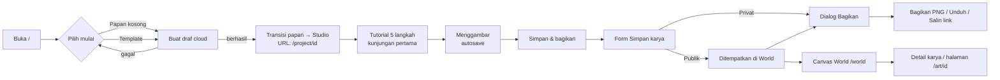
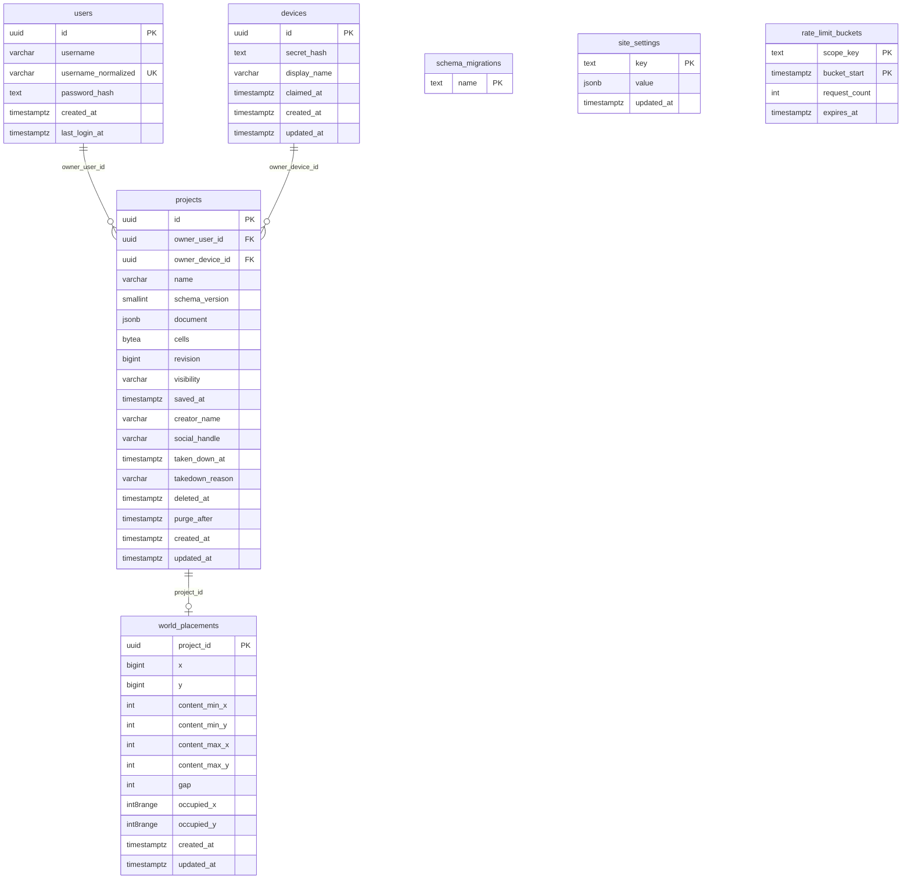
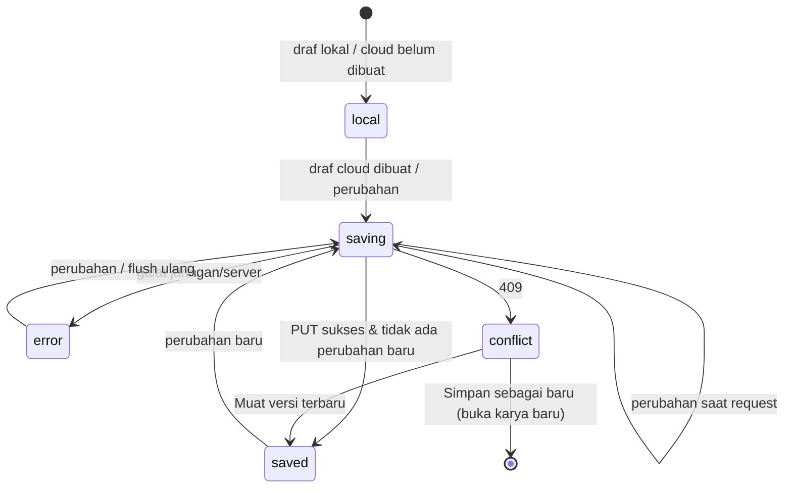
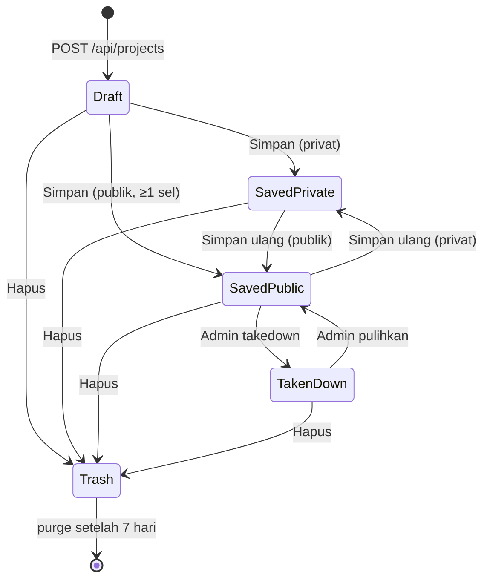

# PRD — MIVUBI Canvas Pixel Exhibition

| | |
| --- | --- |
| Dokumen | Product Requirements Document (untuk implementasi ulang / redesign) |
| Produk | MIVUBI Canvas Pixel — Exhibition Studio |
| Versi dokumen | 1.2 |
| Tanggal | 13 September 2026 |
| Sumber kebenaran | Repo `Image2Pixelart-Local`, branch `feat/canvas-pixel-exhibition-mvp` (commit `77873d0`), folder `docs/foundation/**`, `SECURITY.md`, dan source di `src/**`, `db/**` |
| Status produk saat ini | 4 gerbang lokal hijau: `verify:repository`, vitest 24 file / 114 test, `svelte-check` 0 galat / 0 peringatan, build `adapter-vercel` (`docs/knowledge/current-validation.md:19-31`). Migrasi 001–003 sudah dijalankan di Neon dari `.env.local`; ini **bukan** bukti database staging/produksi siap. Level bukti tertinggi: `LIVE_BROWSER` parsial dengan API tersimulasi (bukan `CLOUD`). **Belum pernah di-deploy.** |
| Bahasa UI | Bahasa Indonesia (`<html lang="id">`) |
| Prototipe UI | Repo ini (`pixel-art`): SvelteKit 2 / Svelte 5 / TS, SPA, backend tiruan di `localStorage` yang meniru kontrak §12. Keputusan rebuild yang sudah diterapkan di prototipe tercatat di **§25**. |

> Dokumen ini merekam **perilaku produk yang benar-benar sudah diimplementasikan**, ditambah konsep, aturan bisnis, dan batasan yang terdokumentasi. Bagian 22–23 memuat temuan inkonsistensi dan keputusan yang perlu diambil sebelum membangun ulang. Label **[USULAN]** menandai hal yang bukan berasal dari produk saat ini. Catatan **"Perilaku saat ini:"** menandai tempat implementasi menyimpang dari kebutuhan; penyimpangannya dicatat sebagai temuan di §22.
>
> **v1.1**: seluruh klaim diverifikasi terhadap source HEAD `77873d0`. Rujukan `file:line` relatif ke root repo tersebut.
>
> **v1.2**: §1–§24 tetap merekam produk sumber dan tidak diubah isinya. Yang baru adalah **§25**, yang mencatat keputusan rebuild (R1–R19) yang sudah diterapkan di prototipe UI, plus penanda `[R#]` di klausa yang keputusannya menggantikan perilaku sumber. DESIGN.md v1.2 memuat spesifikasi visualnya.

---

## Daftar isi

1. [Ringkasan eksekutif](#1-ringkasan-eksekutif)
2. [Latar belakang & konteks](#2-latar-belakang--konteks)
3. [Tujuan, non-tujuan, dan metrik](#3-tujuan-non-tujuan-dan-metrik)
4. [Persona & peran](#4-persona--peran)
5. [Glosarium](#5-glosarium)
6. [Konsep inti produk](#6-konsep-inti-produk)
7. [Peta situs & routing](#7-peta-situs--routing)
8. [User flow detail](#8-user-flow-detail)
9. [Kebutuhan fungsional per modul](#9-kebutuhan-fungsional-per-modul)
10. [Aturan bisnis & batas validasi](#10-aturan-bisnis--batas-validasi)
11. [Model data](#11-model-data)
12. [Kontrak API](#12-kontrak-api)
13. [Algoritma inti](#13-algoritma-inti)
14. [State machine](#14-state-machine)
15. [Spesifikasi UI/UX](#15-spesifikasi-uiux)
16. [Aksesibilitas](#16-aksesibilitas)
17. [Keamanan & privasi](#17-keamanan--privasi)
18. [Kebutuhan non-fungsional](#18-kebutuhan-non-fungsional)
19. [Arsitektur referensi, stack, dan operasional](#19-arsitektur-referensi-stack-dan-operasional)
20. [Strategi pengujian & acceptance criteria](#20-strategi-pengujian--acceptance-criteria)
21. [Di luar cakupan](#21-di-luar-cakupan)
22. [Temuan & rekomendasi untuk rebuild](#22-temuan--rekomendasi-untuk-rebuild)
23. [Keputusan terbuka](#23-keputusan-terbuka)
24. [Lampiran](#24-lampiran)
25. [Keputusan rebuild yang sudah diterapkan](#25-keputusan-rebuild-yang-sudah-diterapkan)

---

## 1. Ringkasan eksekutif

MIVUBI Canvas Pixel adalah aplikasi web pendamping **pameran mozaik pixel fisik**. Pengunjung menyusun Pixel Art di atas papan virtual yang **sama persis dengan papan fisik** (default 240 × 120 cm, grid 48 × 24 sel, 5 cm per sel) dengan palet warna terbatas yang dikunci Admin. Karya lalu disimpan, dibagikan sebagai poster PNG 1080 × 1080 (prototipe: 1080 × 1920, **[R10]**), dan—jika publik—otomatis ditempatkan di **Canvas World**: satu bidang bersama tanpa batas tempat semua karya publik tersusun tanpa saling tumpang tindih.

Perjalanan utama:

```text
Preshow (Hero) → Studio → Simpan / Bagikan → Canvas World
```

Prinsip produk:

- **Tanpa hambatan masuk**: tamu bisa membuat, menyimpan, menerbitkan, mengekspor, dan membagikan tanpa akun. Akun (username + password) opsional dan otomatis "mengklaim" karya tamu dari browser tersebut.
- **Kanvas adalah pusat**: tidak ada panel samping permanen; hanya pilih warna, pasang, hapus, undo/redo, zoom, geser, Fit.
- **Jujur soal penyimpanan**: status "Tersimpan" hanya muncul setelah server berhasil; konflik versi tidak pernah diselesaikan diam-diam.
- **Taktil tapi presisi**: tampilan 2.5D "blok magnet" (bevel, bayangan, blok terangkat), tetapi geometri grid tetap datar sehingga klik selalu tepat sasaran.

---

## 2. Latar belakang & konteks

### 2.1 Pameran fisik

Produk ini mendampingi pameran Canvas Pixel MIVUBI. Papan fisik tersusun dari blok magnet persegi. Aplikasi mereplikasi papan tersebut agar karya digital bisa dipasang secara fisik: satu sel = satu blok.

Di docs, **Around The Block (ATB)** hanya disebut sebagai preset ekspor PNG, "not a global application rebrand" (`docs/foundation/05-ui-design-system.md:16`).

[USULAN] Dua hal berikut belum bersumber di docs:
- warna palet = stok blok fisik yang tersedia;
- kerja sama ATB bertema kota/pulau pixel.

### 2.2 Evolusi dari produk lama

Repositori ini awalnya **"MIVUBI Pixel Mosaic Planner" (Image2Pixelart)**: alat perencana yang mengubah gambar menjadi grid produksi (impor gambar, crop, rekonstruksi warna, palet yang bisa diedit, alat Fill/Pipet/Select, ekspor PDF blueprint/CSV/file proyek, kolaborasi realtime lewat Cloudflare Worker/Durable Objects, aset di R2).

Produk saat ini **mengganti** seluruh alur tersebut dengan pengalaman pameran yang jauh lebih sederhana. Yang tersisa dari produk lama:

- Parser proyek lama schema v1–v3 (hanya dibaca, dinormalisasi ke v4, data gambar dibuang).
- Tabel/kolom legacy di database. Semuanya tidak dihapus, dan sebagian masih disentuh kode:
  - `active_editor_device_id` dan `editor_epoch` masih ditulis saat klaim dan insert proyek;
  - `source_asset_id` dan `project_assets` masih dibaca oleh purge.

  Lihat T10.
- Object store IndexedDB lama (dipertahankan, tidak dibaca).
- Dokumen yang **menggambarkan produk lama**, bukan produk saat ini:
  - `docs/MIVUBI-UI-UX-Redesign/**`;
  - screenshot `docs/home.jpg` dan `docs/editor.jpg`;
  - `docs/knowledge/{ui-language-contract,editor-ui-decisions,ui-preservation-contract,ui-audit}.md`.

  Docs sudah menurunkan statusnya menjadi referensi tanpa otoritas (`docs/README.md:19-30`, `docs/knowledge/README.md:22`). Lihat D1 (sudah diputuskan).

---

## 3. Tujuan, non-tujuan, dan metrik

### 3.1 Tujuan

| ID | Tujuan |
| --- | --- |
| G1 | Pengunjung pameran bisa membuat karya pertamanya tanpa mendaftar. [USULAN: target < 1 menit — tidak ada di docs.] |
| G2 | Karya digital identik 1:1 dengan papan fisik (dimensi, jumlah sel, palet). |
| G3 | Karya publik langsung tampil di Canvas World dan halaman publik yang bisa dibagikan. |
| G4 | Pengunjung bisa membagikan poster PNG bermerek ke media sosial dari ponsel. |
| G5 | Admin dapat mengatur ukuran papan, palet, jarak World, template poster, serta menurunkan (takedown) karya bermasalah tanpa menghapus data. |
| G6 | Tidak ada kehilangan data diam-diam: draf selalu punya cadangan lokal, konflik selalu terlihat. |

### 3.2 Non-tujuan

Bukan editor raster umum, bukan jejaring sosial (tidak ada like/komentar/follow), bukan whiteboard kolaboratif realtime. Daftar lengkap di §21.

### 3.3 Metrik keberhasilan [USULAN]

Produk saat ini tidak memiliki analitik. Usulan metrik bila ditambahkan:

- Waktu dari buka halaman → blok pertama terpasang (median).
- % draf yang berakhir "Simpan karya"; % yang publik.
- % penyimpanan yang berakhir `error`/`conflict`.
- Jumlah share/unduh PNG per karya tersimpan.
- Jumlah takedown per 100 karya publik.

---

## 4. Persona & peran

| Peran | Deskripsi | Autentikasi | Hak |
| --- | --- | --- | --- |
| **Tamu (Guest)** | Pengunjung tanpa akun. Identitas = kredensial perangkat anonim di browser. | Header `X-Device-Id` + `Authorization: Bearer <secret>` | Membuat, mengedit, menyimpan, menerbitkan, menghapus, mengekspor karya miliknya di perangkat itu. |
| **Kreator ber-akun** | Pengguna yang mendaftar username/password. | Cookie sesi bertanda tangan `mivubi_user_session` | Sama seperti tamu, tetapi lintas perangkat. Karya tamu di perangkat saat daftar/masuk otomatis diklaim. |
| **Pengunjung publik** | Siapa pun yang membuka World atau link karya. | Tidak ada | Melihat karya publik yang memenuhi syarat, mengunduh/membagikan PNG karya publik. |
| **Admin Website** | Pengelola pameran. | Password tunggal (hash di env), cookie `mivubi_admin_session` | Mengatur Canvas, palet, gap World, template poster, hitung ulang tata letak World, takedown/pulihkan karya. **Tidak pernah menjadi pemilik karya** dan tidak bisa mengedit konten karya. Takedown/pulihkan menaikkan `revision` + `updated_at`, sehingga autosave pemilik berikutnya kena konflik (T15). |

Ketiga domain autentikasi (akun, perangkat, admin) saling independen; tidak ada yang menyiratkan yang lain.

---

## 5. Glosarium

| Istilah | Arti |
| --- | --- |
| **Canvas** | Papan fisik beserta ukurannya (lebar, tinggi, ukuran sel dalam mm). |
| **Grid** | Representasi Canvas dalam sel: `columns × rows`. Default 48 × 24 = 1.152 sel. |
| **Sel / Blok** | Satu kotak grid. Terisi = berisi indeks slot palet; kosong = `EMPTY_CELL` (`0xFFFF`). |
| **Palet terkunci** | Daftar 0–32 warna yang disalin dari pengaturan Admin saat karya dibuat; tidak bisa diubah pengguna. |
| **Slot** | Posisi warna dalam palet (0-based). Sel menyimpan slot, bukan HEX. |
| **Karya / Proyek / Project** | Satu dokumen grid milik tepat satu pemilik. |
| **Draf** | Karya yang belum pernah "Simpan karya" (`saved_at = NULL`). Selalu privat. |
| **Karya tersimpan** | Karya yang sudah melalui form "Simpan karya" (`saved_at` terisi). |
| **Publik / Privat** | Visibilitas karya tersimpan. |
| **Eligible publik** | Tersimpan + publik + minimal 1 sel terisi + tidak dihapus + tidak di-takedown. |
| **Takedown** | Tindakan Admin menyembunyikan karya dari publik (reversibel). |
| **Content bounds** | Persegi terkecil yang memuat semua sel terisi. |
| **Canvas World** | Bidang bersama tanpa batas berisi karya publik, ditempatkan berdasarkan content bounds. |
| **Placement** | Posisi (x, y) karya di World + bounds + gap saat penempatan. |
| **Gap** | Jarak minimum (dalam sel) antar karya di World. Default 4. |
| **Revision** | Nomor versi karya di server; naik setiap penulisan; dipakai sebagai `If-Match`. |
| **Preshow / Hero** | Halaman depan sebelum masuk Studio. |
| **Studio** | Editor. |
| **Karyaku** | Daftar karya milik pengguna (`/works`). |
| **Poster / Template poster** | Desain PNG 1080 × 1080 yang membingkai karya untuk dibagikan. Prototipe memakai 1080 × 1920 (**[R10]**). |

---

## 6. Konsep inti produk

### 6.1 Invarian fisik Canvas & Grid

```text
widthMm  = 2400   (240 cm)
heightMm = 1200   (120 cm)
cellMm   = 50     (5 cm)
columns  = widthMm / cellMm  = 48
rows     = heightMm / cellMm = 24
cells    = 1152 entri row-major
index    = y * columns + x   (satu-satunya aturan indeks)
```

- Admin boleh mengubah Canvas **untuk karya baru**; lebar dan tinggi harus habis dibagi ukuran sel.
- Setiap karya **menyimpan snapshot** kelima nilai tersebut. Struktur karya yang sudah ada **tidak pernah berubah**.
- Batas: maks 2.000 sel per sisi, maks 250.000 sel total, maks ukuran fisik 1.000.000 mm, presisi input 0,1 cm.

### 6.2 Palet terkunci

- Admin mengatur 1–32 warna dengan format `#HEX | Nama`.
  - HEX duplikat ditolak.
  - Nama > 80 karakter dipotong diam-diam.
  - Admin **tidak** mengisi id. Server membuat id `site-<n>-<hex>` setiap kali palet disimpan, sehingga id `default-*` di Lampiran E hilang setelah simpan pertama (`lib/server/site-settings.ts:57-60`).
- Saat karya dibuat, palet disalin sebagai snapshot dan setiap entri ditandai `locked: true`.
- Pengguna hanya **memilih** warna; tidak bisa menambah, mengubah, atau menghapus warna.
- Mengubah palet Admin **tidak mengubah karya lama**.
- Server menolak pembuatan karya jika palet yang dikirim klien berbeda dari palet Admin saat itu (409: "Palet Website telah berubah. Muat ulang studio sebelum membuat karya.").

### 6.3 Blok magnet 2.5D (visual saja)

Kedalaman murni kosmetik; transformasi grid tetap datar dan sejajar sumbu sehingga pemetaan koordinat pointer → sel hanya melewati pan/zoom.

- Papan: bingkai hitam bergradasi dengan sudut membulat (radius 20) dan bevel tipis; area grid ivory `#FBFAF4`.
- Blok: persegi penuh sel-ke-sel (tanpa celah), gradasi terang di atas/gelap di bawah, garis sambungan internal 1 device-pixel (terang kiri/atas, gelap kanan/bawah).
- Ghost: pratinjau blok transparan (alpha 0,65) dengan outline hijau di sel yang di-hover.
- Settle: blok baru "berkilau" 160 ms setelah dipasang.
- Rak palet: rak kayu dengan kompartemen; swatch terpilih terangkat 10 px dan diberi outline.

### 6.4 Kepemilikan (exactly-one owner)

```text
Pemilik akun:  owner_user_id = <user>,  owner_device_id = NULL
Pemilik tamu:  owner_user_id = NULL,    owner_device_id = <device>
```

- Database menegakkan tepat satu pemilik (`CHECK num_nonnulls(...) = 1`).
- Signup/login yang disertai kredensial perangkat valid mengklaim **semua** karya tamu perangkat itu dalam **satu transaksi**. Setelah diklaim, kredensial perangkat saja tidak lagi memberi akses.
- Perangkat yang sudah diklaim (`devices.claimed_at` terisi) tidak bisa lagi membuat karya tamu baru (409).

### 6.5 Siklus hidup karya

```text
Draf (privat, saved_at NULL)
  → Simpan karya: judul/kreator/sosmed + publik/privat, saved_at pertama tercatat
     → Publik & eligible → ditempatkan di World
     → Privat → tidak di World
  → Edit lanjutan (autosave) → jika publik, World membaca revisi cloud terbaru
  → Hapus (soft delete) → masuk Sampah 7 hari → dibersihkan cron
Admin: Takedown ↔ Pulihkan (hanya untuk karya tersimpan & publik)
```

### 6.6 Syarat tampil publik (eligibility)

Karya bisa diambil publik (World maupun `/art/[id]`) **hanya jika semua benar**:

1. `saved_at` terisi,
2. `visibility = 'public'`,
3. minimal satu sel terisi,
4. `deleted_at` kosong,
5. `taken_down_at` kosong.

Selain itu → **404** (tanpa membocorkan keberadaan karya). Nama kreator kosong ditampilkan sebagai **"Anonim"**. Username akun **tidak pernah** dipublikasikan otomatis.

Implementasi: semua endpoint publik (feed, `/api/public/artworks/[id]`, `/api/world`) juga melakukan `JOIN world_placements`. Artinya syarat ke-3 ditegakkan lewat keberadaan placement, karena placement hanya ada untuk karya berisi.

### 6.7 Canvas World

- Bidang koordinat integer (satuan = sel), pusat (0,0).
- Karya ditempatkan berdasarkan **content bounds** (bukan seluruh 48 × 24), sehingga karya kecil memakan ruang kecil.
- Posisi awal deterministik dari `saved_at + project id`, mencari dari pusat keluar secara radial (golden-angle), dengan sedikit bias horizontal.
- Tidak boleh ada tumpang tindih — ditegakkan oleh **exclusion constraint PostgreSQL** + advisory lock.
- Mengedit karya publik mempertahankan posisi selama bounds baru masih muat; jika tidak, **hanya karya itu** yang pindah.
  - "Posisi" di sini berarti (x, y) pojok kiri-atas **content bounds**, bukan pojok papan.
  - Karena itu, menambah atau menghapus sel di tepi kiri/atas akan menggeser isi karya secara visual di World (`world-placement.ts:123-124,155-161`).
- Mengubah gap hanya berlaku untuk penempatan baru/pemindahan; tidak ada repack otomatis.
- Admin dapat secara eksplisit mempratinjau dan menerapkan **hitung ulang tata letak** seluruh World. Ini repack total yang mengabaikan posisi lama.
- Pembacaan World selalu dibatasi viewport, kursor, dan limit.

---

## 7. Peta situs & routing

### 7.1 Halaman publik

| Route | Nama | Akses | Keterangan |
| --- | --- | --- | --- |
| `/` | Preshow + Studio | Semua | Hero; masuk Studio tanpa pindah halaman (URL berganti ke `/project/[id]` via shallow routing). |
| `/project/[id]` | Studio (hard reload) | Pemilik | Membuka karya dari cloud (atau cadangan lokal). `noindex` hanya saat hard reload; URL shallow yang dicapai dari `/` tidak punya meta robots. |
| `/works` | Karyaku | Tamu/akun | Draf dan karya tersimpan milik principal saat ini. `noindex`. |
| `/world` | Canvas World | Publik | Jelajah karya publik. |
| `/art/[id]` | Karya publik | Publik | Tampilan read-only + bagikan/unduh. 404 jika tidak eligible. |
| `/account` | Akun | Semua | Daftar/Masuk; `?mode=signup|login&next=/path`. `noindex`. |

### 7.2 Halaman Admin (domain terpisah)

| Route | Nama |
| --- | --- |
| `/admin/login` | Masuk Admin (password saja) |
| `/admin` | Dashboard ringkasan |
| `/admin/artworks` | Moderasi karya |
| `/admin/settings` | Hub Pengaturan Website |
| `/admin/settings/canvas` | Canvas, Palet, Gap World |
| `/admin/settings/posters` | Template Poster PNG |
| `/admin/settings/world-layout` | Hitung ulang tata letak World |

Semua halaman Admin `noindex,nofollow`; tanpa sesi → redirect 303 ke `/admin/login`.

### 7.3 Navigasi global

- Header publik: brand MIVUBI (ke `/`), tautan **Canvas World** dan **Karyaku**, serta **menu profil** (lihat §9.10).
- Aplikasi berjalan sebagai SPA (SSR dimatikan global); `+page.server` hanya dipakai untuk memuat pengaturan Canvas/palet di `/`, data karya publik di `/art/[id]`, dan seluruh Admin.

---

## 8. User flow detail

### 8.1 Diagram perjalanan utama



### 8.2 F1 — Masuk dan melihat Preshow

1. Browser memuat `/`. Server mengembalikan pengaturan Canvas & palet Admin saat ini.
2. Klien membuat atau membaca identitas perangkat anonim dari `localStorage`: id UUID, secret 32 byte hex, dan nama tampilan `User-01`, `User-02`, dst.
   - Validasi saat membaca: id cocok dengan `^[0-9a-f-]{36}$` dan secret ≥ 32 karakter. Format hex dan panjang 64 tidak dicek.
   - Perilaku saat ini: akses `localStorage` tidak dibungkus try/catch. Kalau storage diblokir, layar "Menyiapkan…" di `/` tidak pernah selesai.
3. Klien membuat proyek kosong lokal (belum dikirim ke server) dari pengaturan tersebut. Nama defaultnya **"Canvas Pixel"**. Layar muat menampilkan "Menyiapkan Canvas Pixel…".
4. Di latar belakang: registrasi perangkat (`POST /api/devices/register`) dan cek sesi (`GET /api/auth/me`). Kegagalan cek akun tidak menghalangi tamu.
5. Hero menampilkan:
   - Nav: brand, Canvas World, Karyaku, menu profil.
   - Intro: eyebrow "AROUND THE BLOCK · MOSAIC CANVAS", judul **"Satu blok. Banyak cerita."**, deskripsi, tombol **"Mulai dari papan kosong →"**.
   - **Papan komunitas** (HeroBoard): papan hitam 96 × 48 berisi hingga 6 karya publik terbaru (pratinjau), dapat diklik ke `/world` ("Buka dunia pixel ↗"). Diperbarui tiap 30 detik dan saat tab kembali terlihat; tidak memuat saat tab tersembunyi.
   - **Galeri template**: "Pilih inspirasi pertamamu" — 6 template (Pohon, Smiley, Hati, Bintang, Rumah, Merah Putih) yang sudah dipetakan ke grid & palet saat ini.
   - Footer: "VERSI VIRTUAL PAMERAN MIVUBI — Dibuat satu blok demi satu blok."
6. Status feed: kosong → "Panggung masih kosong. Jadilah yang pertama berkarya."; gagal → "Karya komunitas belum dapat dimuat. Kamu tetap bisa mulai berkarya." (untuk pembaca layar).

### 8.3 F2 — Mulai berkarya (papan kosong atau template)

1. Pengguna menekan "Mulai dari papan kosong" atau kartu template. Tombol dinonaktifkan; label "Menyiapkan studio…".
2. Klien membuat proyek baru segar (id baru). Jika template: pola dipusatkan, diskalakan tanpa interpolasi, warna dipetakan ke slot palet terdekat (§13.6); nama proyek = nama template.
3. Pastikan perangkat terdaftar → simpan draf ke IndexedDB → `POST /api/projects` (draf privat).
4. Jika **gagal**: tetap di Preshow dan tampilkan banner galat `.root-error` (`role=alert`). Banner ini menetap sampai ditutup manual; bukan toast. Tidak ada Studio setengah jadi. Draf IndexedDB yang sudah terlanjur dibuat tertinggal sebagai draf yatim.
5. Jika **berhasil**: animasi transisi (§15.6) — Hero memudar, papan komunitas membesar ke posisi papan Studio, isi papan crossfade ke draf, lalu kontrol dan rak muncul bertahap. URL berganti ke `/project/[id]` tanpa reload (shallow `pushState`).
6. Fokus keyboard pindah ke kanvas. Jika belum pernah, tutorial 5 langkah muncul otomatis setelah transisi.
7. Jika cadangan lokal gagal dibuat tetapi cloud berhasil: pesan "Draf sudah tersimpan di cloud, tetapi cadangan perangkat belum dapat dibuat."
8. Tombol **Back** browser mengembalikan ke Preshow **tanpa flush**: `entered=false` membuat `flushSave` keluar lebih awal. Tombol ← di header melakukan flush, lalu memanggil `history.back()`.
9. Memulai lagi selalu membuat **draf baru terpisah** (riwayat undo dan metadata direset). Debounce draf lama dibatalkan tanpa flush.

> Karya komunitas di papan Hero **tidak pernah** masuk ke draf baru.

### 8.4 F3 — Menggambar di Studio

1. Pilih warna di rak (atau tombol 1–8) → alat otomatis jadi "pasang".
2. Klik/ketuk sel untuk memasang; tarik untuk menggambar beruntun (garis Bresenham antar sel agar tidak ada lompatan).
3. Pilih **Hapus** di ujung rak (atau `E`) untuk menghapus.
4. **Undo/Redo** per goresan (satu goresan = satu entri riwayat).
5. **Zoom** (−, +, Ctrl/Cmd + scroll, cubit dua jari), **Geser** (toggle, `H`, tombol tengah mouse, dua jari), **Fit** (`0`).
6. Toggle **Grid** menyembunyikan garis grid.
7. Setiap perubahan → autosave (F4).

Aturan sentuh: satu jari menggambar; gerakan < 4 px dianggap tap (pasang saat jari diangkat); dua jari = pan+zoom dan **tidak pernah** menggambar; goresan yang sedang berjalan dihentikan saat jari kedua masuk.

### 8.5 F4 — Autosave

1. Setiap perubahan: status → "Menyimpan…" (atau "Tersimpan di perangkat" jika draf cloud belum ada), draf ditulis ke IndexedDB segera.
2. Debounce **1,4 detik**, lalu `PUT /api/projects/[id]` dengan `If-Match: <revision>`.
3. Sukses → revision naik; jika tidak ada perubahan baru selama request → "Tersimpan" dan draf lokal dihapus.
4. Perubahan yang terjadi selama request → dijadwalkan ulang; tidak pernah melaporkan "Tersimpan" untuk snapshot yang lebih lama.
5. Flush paksa dilakukan saat tab disembunyikan (`visibilitychange`), saat `pagehide`, sebelum aksi akun (termasuk Keluar dari menu profil), dan saat menekan tombol ← di header.
   - Perilaku saat ini: link brand, Canvas World, dan Karyaku di header Studio, serta link di menu profil, berpindah halaman SPA **tanpa flush**. `onDestroy` membatalkan timer.
   - Akibatnya perubahan ≤ 1,4 detik terakhir tidak sampai ke cloud. Perubahan itu tetap aman di IndexedDB dan dipulihkan saat karya dibuka lagi (T17).
6. Galat jaringan/server → status "Gagal disimpan", dan pesan tampil di banner `.root-error`.
   - Pesan yang **benar-benar** tampil adalah salah satu dari: `body.error` dari server, "Request gagal (N).", atau pesan galat fetch dari browser.
   - Fallback "Autosave cloud gagal. Draf tetap tersimpan di perangkat." / "Autosave cloud dan cadangan perangkat gagal. Jangan tutup halaman ini." praktis tidak pernah tampil, karena `api()` selalu mengisi `message` (`lib/cloud/api.ts:23`; T17).
7. **409 konflik** → autosave berhenti, status "Ada versi lebih baru", dialog konflik (F6).

### 8.6 F5 — Simpan karya & bagikan

1. Tekan **"Simpan & bagikan"** di header.
2. Dialog **"Siapa di balik Pixel Art ini?"** (fokus ke judul, teks terseleksi):
   - Judul karya (opsional, placeholder "Karya tanpa judul", maks 200). Untuk proyek baru, field ini sudah terisi nama default "Canvas Pixel", jadi placeholder tidak terlihat.
   - Nama kreator (opsional, maks 80, placeholder "Nama atau nama panggung").
   - Akun sosial (opsional, placeholder "@username"). Perilaku saat ini: UI membatasi `maxlength=100`, sedangkan server 120 (T2).
   - Visibilitas: **Publik** ("Tampil di Canvas World dan dapat dibagikan.") — default terpilih; **Privat** ("Hanya tersedia untuk perangkat atau akunmu.").
   - Untuk tamu: peringatan **"Jangan kehilangan akses edit."** + tautan "Buat akun opsional" (melakukan flush dulu; gagal → tetap di editor).
   - Tombol: Batal / Simpan karya.
3. Submit:
   - Jika judul berubah, nama proyek diperbarui dan di-autosave.
   - Flush autosave. Syarat blokir dan pesannya berbeda antar-route (T5):
     - di `/`: draf cloud belum siap, masih ada perubahan, atau sedang konflik → "Draf cloud belum siap. Coba lagi setelah koneksi pulih.";
     - di `/project/[id]`: "Selesaikan konflik versi sebelum menyimpan karya.", dan `saveState==='error'` juga memblokir.
   - `POST /api/projects/[id]/save` dengan `If-Match`. Kalau hasilnya 409, yang muncul hanya toast merah "Proyek berubah di tempat lain."; dialog konflik F6 **tidak** muncul dan status konflik tidak diset.
   - Server: publik tetapi kosong → 400 "Isi minimal satu pixel sebelum menayangkan karya."; `saved_at` hanya diisi pertama kali; publik+eligible → tempatkan di World dalam transaksi yang sama; privat → hapus placement.
4. Sukses → dialog simpan tertutup, **dialog Bagikan** terbuka, toast "Karya disimpan dan siap dibagikan." / "Karya disimpan privat." Prototipe: dialog itu berjudul "Karya tersimpan" dan hanya berisi Unduh PNG + Simpan (**[R14]**).
5. Dialog **"Bagikan Pixel Art-mu"**:
   - Keterangan sesuai status (publik tampil / publik tapi tidak tampil / privat).
   - Memuat katalog template poster terbaru (`GET /api/public/poster-templates`). Gagal → pesan + "Coba lagi"; tombol PNG dinonaktifkan.
   - Pilihan desain poster berupa radio dengan **pratinjau PNG asli** tiap template.
   - Tombol: **Bagikan** (Web Share file PNG; fallback unduh + salin link), **Unduh PNG**, **Salin link** (hanya publik; fallback kolom teks untuk salin manual).
   - Sebelum fetch selesai, dialog memakai `DEFAULT_POSTER_TEMPLATES`. Kalau template terpilih hilang dari katalog baru, pilihan pindah ke template pertama.
   - Katalog gagal dimuat → tombol Bagikan dan Unduh sama-sama dinonaktifkan.
   - Galat `share()` selain `AbortError` diam-diam jatuh ke fallback.
6. Nama file: `<judul-aman>-<id-template>.png`.
   - Judul diubah ke huruf kecil, dan setiap karakter di luar `[a-z0-9]` diganti "-". Judul kosong → `mosaic-project`.
   - Id template hasil upload berupa UUID.

### 8.7 F6 — Konflik versi

Terjadi saat revision di server ≠ revision klien, mis. karya diedit di tab/perangkat lain, **atau Admin melakukan takedown/pulihkan** (T15).

Dialog hanya dipicu oleh 409 dari autosave `PUT`. 409 dari `POST /save` hanya menghasilkan toast (F5).

- Dialog **"Karya berubah di tempat lain"** (tidak bisa ditutup dengan Escape): "Draf di perangkat ini tetap aman. Pilih versi terbaru dari cloud, atau simpan perubahanmu sebagai karya baru."
- **Muat versi terbaru**: ambil ulang dari server, buang draf lokal, reset riwayat undo & form.
- **Simpan sebagai baru**: buat karya baru (id baru, nama "`<nama> (salinan)`") dari draf lokal, lalu buka karya baru tersebut.
- Dilarang: last-write-wins diam-diam atau resolusi destruktif otomatis.

### 8.8 F7 — Membuka ulang karya (`/project/[id]`)

1. Baca draf lokal (IndexedDB) jika ada → registrasi perangkat → cek sesi → `GET /api/projects/[id]`.
2. Status awal adalah `saved`.
   - Jika draf lokal **lebih baru** dari cloud dan pengguna adalah pemilik → pakai draf lokal, status `local`, `dirty=true`.
     - Tidak ada timer yang dijadwalkan: draf baru terkirim saat edit berikutnya, `visibilitychange`, `pagehide`, atau Simpan.
   - Draf lokal yang lebih lama dari cloud diabaikan, tetapi tidak dihapus.
3. **410** (di Sampah) → halaman "Karya ini berada di Sampah" dengan teks "Karya dijadwalkan terhapus pada `<toLocaleString id-ID>`." (atau "Karya ini tidak lagi tersedia.") dan tombol "Kembali ke Karyaku".
   - Non-pemilik lebih dulu mendapat 403.
4. Galat jaringan atau 5xx, dan ada draf lokal → **mode cadangan lokal**.
   - Karya tetap bisa diedit dengan status "Tersimpan di perangkat" dan pesan "Cloud belum dapat dijangkau. Cadangan perangkat dibuka dan tetap dapat diedit; muat ulang untuk menyambungkan kembali."
   - Simpan karya dinonaktifkan sampai tersambung.
   - Mode ini juga terpicu kalau `register` atau `auth/me` gagal dengan ≥ 500 atau tanpa status. Dalam mode ini `editable=true` tanpa cek pemilik.
5. Galat lain (403/404) → pesan galat + "Kembali ke Karyaku".
6. Tombol kembali di header → flush → `/works`.

### 8.9 F8 — Akun (daftar / masuk / keluar)

1. Dari menu profil "Masuk"/"Daftar", tautan di dialog simpan, atau `/account`. Sebelum pindah dari editor, autosave di-flush; jika gagal/konflik → tetap di editor dengan pesan "Perubahan belum tersimpan di cloud. Selesaikan penyimpanan atau konflik sebelum beralih akun."
2. `/account` default mode **Daftar**; tab Daftar/Masuk.
   - Daftar: "Amankan karyamu" — "Draf dari perangkat ini otomatis terhubung setelah akun dibuat." + catatan **"Catat password-mu. Versi ini belum menyediakan pemulihan password lewat email."** Tombol "Buat akun & simpan".
   - Masuk: "Buka kembali karyamu".
   - Tombol aktif hanya jika username ≥ 3 dan password ≥ 8.
3. Request membawa header perangkat → server mengklaim semua karya tamu perangkat itu secara transaksional → set cookie sesi → redirect ke `next` (default `/works`; hanya path relatif yang aman diterima).
   - Karya yang `purge_after`-nya sudah lewat tidak ikut diklaim.
   - Kredensial perangkat yang tidak valid membuat seluruh request 401.
   - Login saat sudah masuk diizinkan (ganti akun). Hanya signup yang menolak dengan 409 "Kamu sudah masuk ke akun.".
   - Perilaku saat ini: notifikasi hasil klaim langsung hilang karena redirect (T7).
4. Sudah masuk: "Halo, <username>" + Buka Karyaku / Buat karya baru / Keluar.
5. **Keluar**: hapus cookie, lalu **rotasi identitas perangkat** (buat perangkat tamu baru).
   - Dari menu profil, pengguna lalu dibawa ke `/`. Dari `/account`, pengguna tetap di `/account` dengan mode Masuk.
   - Kalau registrasi perangkat baru gagal: "Kamu sudah keluar, tetapi identitas tamu baru belum siap. Muat ulang halaman untuk mencoba lagi."

### 8.10 F9 — Karyaku (`/works`)

1. Registrasi perangkat → cek sesi → `GET /api/projects`.
2. Dua bagian:
   - **"SUDAH DISIMPAN — Karya"**: thumbnail, badge Publik/Privat atau "Tidak tampil di publik" (takedown), judul, kreator/"Anonim", "48 × 24 sel", tanggal diperbarui; aksi **Edit**, **Salin link** (publik & tidak takedown), **Hapus**.
   - **"DRAF CLOUD — Belum dibagikan"**: badge "Draf", "Lanjutkan lalu simpan karya"; aksi **Lanjutkan**, **Hapus**.
3. Kosong: "Canvas-mu masih kosong — Mulai dari satu blok." + "Mulai berkarya".
4. Galat: "Karyamu belum dapat dimuat — Tidak ada karya yang dihapus." + "Coba lagi". Tombol "Coba lagi" berupa link `<a href="/works">`.
   - Kalau `auth/me` gagal (non-OK), seluruh halaman menjadi galat: "Akun belum dapat diperiksa."
5. Hapus: konfirmasi → `DELETE` dengan `If-Match` → soft delete (masuk Sampah 7 hari) → placement World dihapus.
   - Perilaku saat ini: konfirmasi memakai `confirm()` bawaan browser (T9).
   - Tidak ada UI atau API untuk melihat maupun memulihkan isi Sampah (T19).
6. Salin link berhasil → "Link disalin" selama 2,5 detik. Kalau gagal, tidak ada kolom salin manual (T9).

### 8.11 F10 — Canvas World (`/world`)

1. Muat karya di viewport (+ margin 24 sel), maksimal 4 halaman × 24 karya per pemuatan.
   - Pemuatan pertama tanpa debounce. Setelahnya ada debounce 220 ms setiap pan/zoom/resize.
   - Pan dengan drag atau cubit baru memicu pemuatan saat pointer dilepas.
2. Pertama kali ada karya → kamera otomatis membingkai seluruh karya yang termuat. Zoom awal 0,9.
3. Interaksi:
   - Drag untuk geser. Scroll juga menggeser (Shift = horizontal).
   - Ctrl/Cmd+scroll atau cubit untuk zoom.
   - Tombol −, +, dan **Pusat**. Label % di antaranya hanya teks, bukan tombol.
   - Keyboard: panah 70 px (Shift = 140 px), `+`/`-` untuk zoom, `0`.
   - **Pusat** dan `0` memanggil `frameArtworks()`, yang membingkai ulang semua karya termuat. Kamera baru kembali ke (0,0) zoom 0,9 kalau tidak ada karya.
4. Hover karya → tooltip (judul, kreator, "Klik untuk melihat karya"). Tooltip hanya muncul untuk mouse.
5. Klik karya (bukan drag) atau tombol di daftar → **dialog detail** tanpa navigasi.
   - Dialog memvalidasi ulang ke API publik. Kalau 404 → "Karya ini sudah tidak tersedia untuk publik.", tetapi karya tetap tampil di World sampai pemuatan berikutnya.
   - Isi dialog: judul, kreator · sosmed, pratinjau area terisi, dan "`<columns>` kolom × `<rows>` baris · Area kosong transparan".
   - Tidak ada link ke `/art/[id]`.
   - Kamera tidak berubah; fokus kembali ke pemicu setelah dialog ditutup.
6. Panel samping **"Karya yang terlihat"** (jumlah + daftar tombol) sebagai alternatif semantik; di mobile menjadi strip horizontal di bawah.
7. Area terlalu padat (> 4 halaman) → "Area ini sangat padat. Geser atau zoom untuk memuat bagian lain."
8. Kosong → "Belum ada karya di area ini. Geser kembali ke pusat atau mulai karya pertama." Galat → pesan + "Coba lagi".

### 8.12 F11 — Halaman karya publik (`/art/[id]`)

1. Server memuat data publik; tidak eligible → halaman 404 standar.
2. Kiri: kanvas read-only (bisa zoom/geser/Fit).
3. Kanan, dari atas ke bawah:
   - eyebrow "CANVAS WORLD" dan judul;
   - byline bertumpuk tanpa titik tengah: "Karya", lalu `<strong>` kreator/Anonim, lalu `<small>` sosmed;
   - fakta: Ukuran Grid dan Diperbarui;
   - pilihan **Border PNG** (Default / ATB). Perilaku saat ini: pilihan ini hardcoded dan tidak memakai katalog template Admin (T1);
   - tombol **Bagikan karya**, **Unduh PNG**, **Salin link**;
   - tautan "Temukan karya lainnya →" ke World.
4. Id yang bukan UUID membuat API membalas 400. Halaman `/art` mengubah 400 maupun 404 menjadi 404.

### 8.13 F12 — Alur Admin

1. **Login**: password → sesi 8 jam. Salah → "Password Admin tidak sesuai."
   - Rate limit 10 / 15 menit per IP. Perilaku saat ini: melebihi batas menghasilkan halaman error **500** generik, bukan 429 (T16).
   - Admin yang sudah punya sesi dan membuka halaman login di-redirect ke `/admin`.
   - Password > 1024 karakter ditolak.
2. **Dashboard**: kartu "Canvas, Palet & World" (ringkasan ukuran fisik, jumlah warna, gap) dan "Moderasi reaktif".
3. **Pengaturan Pameran** (`/admin/settings/canvas`): 3 form independen (Canvas, Palet, Gap) — §9.13.
4. **Template poster**: kelola 1–8 template — §9.14.
5. **Hitung ulang tata letak**: pratinjau → centang konfirmasi → terapkan — §9.15.
6. **Moderasi**: cari/filter karya publik tersimpan → Takedown (wajib alasan) / Pulihkan — §9.12.
7. **Keluar**: hapus cookie Admin → `/admin/login`.

---

## 9. Kebutuhan fungsional per modul

Format: **FR-<modul>-<nomor>**. "HARUS" = wajib; "SEBAIKNYA" = dianjurkan.

### 9.1 Identitas perangkat (DEV)

- **FR-DEV-01** Klien HARUS membuat identitas perangkat sekali per browser: `id` (UUID v4), `secret` (32 byte acak, hex 64 char), `displayName` (`User-NN` berurutan). Disimpan di `localStorage` (`mivubi-cloud-device-v1`, `mivubi-device-sequence-v1`).
- **FR-DEV-02** Identitas tidak valid di storage HARUS diganti yang baru.
- **FR-DEV-03** Setiap request owner-only dari tamu HARUS mengirim `X-Device-Id` dan `Authorization: Bearer <secret>`.
- **FR-DEV-04** Server HARUS menyimpan hanya HMAC-SHA256(secret, `DEVICE_TOKEN_PEPPER`), bukan secret mentah; verifikasi timing-safe.
- **FR-DEV-05** Registrasi idempoten: id yang sama dengan secret yang sama → update nama; id sama dengan secret berbeda → 401.
- **FR-DEV-06** Logout akun HARUS merotasi identitas perangkat.

### 9.2 Preshow / Hero (HERO)

- **FR-HERO-01** Menampilkan papan komunitas berisi maks 6 karya publik terbaru.
  - Jumlah kolom grid = min(3, n).
  - Setiap karya diskalakan tanpa interpolasi ke zonanya, dengan skala maksimal 3× dan margin 6 sel.
  - Perilaku saat ini: API mengirim 12 karya, tetapi Hero hanya memakai 6 (T8).
- **FR-HERO-02** Feed dimuat ulang tiap 30 detik dan saat tab kembali terlihat; tidak memuat saat tab tersembunyi; `cache: no-store`.
- **FR-HERO-03** Papan komunitas adalah tautan ke `/world` dengan label aksesibel yang menyebut judul & kreator karya yang tampil.
- **FR-HERO-04** Menampilkan 6 template bawaan (Lampiran A) sebagai pratinjau yang sudah disesuaikan dengan grid & palet Admin saat ini.
- **FR-HERO-05** Memilih template atau papan kosong membuat draf cloud baru (F2). Kegagalan tidak boleh memindahkan pengguna ke Studio.
- **FR-HERO-06** Kontrol Studio yang tersembunyi di belakang Preshow HARUS `inert`/`aria-hidden` sehingga tidak bisa dijangkau keyboard/pembaca layar.
  - Perilaku saat ini: header, topbar, dan rak sudah memenuhinya.
  - Tetapi `section.workspace`/canvas-host hanya `inert` saat `entering` dan tidak pernah `aria-hidden`. Akibatnya label kanvas terbaca pembaca layar selama Preshow (`StudioScene.svelte:472,491`; `ExhibitionCanvas.svelte:410,419-421`).

### 9.3 Studio — Kanvas (CANVAS)

- **FR-CANVAS-01** Render papan dengan Canvas 2D, device pixel ratio maks 2, sisi maks 16.000 px.
- **FR-CANVAS-02** Ukuran sel "Fit" = min(34, max(3, ruang tersedia / kolom|baris)).
  - Perhitungannya memasukkan tinggi toolbar atas dan rak bawah yang terukur lewat ResizeObserver, padding luar 28 px, dan bingkai 22 px.
  - Ukuran sel efektif minimum 2 px. Viewport minimum 320 × 120.
- **FR-CANVAS-03** Zoom 0,6×–7× relatif terhadap Fit. Tombol ×/÷1,2; keyboard ×/÷1,15; Ctrl/Cmd+scroll ×1,1/×0,9; cubit proporsional jarak jari.
- **FR-CANVAS-04** Fit memusatkan papan di area yang tidak tertutup kontrol.
- **FR-CANVAS-05** Hit test: `floor((client - rectLeft - frame) / cellSize)`; di luar grid → tidak ada aksi.
- **FR-CANVAS-06** Garis grid digambar jika toggle aktif dan ukuran sel ≥ 3 px.
- **FR-CANVAS-07** Ghost preview mengikuti hover: warna aktif untuk pasang, ivory `#FEFAEC` untuk hapus, dan tidak ada untuk mode geser. Gradasi dan garis sambungan blok hanya digambar kalau sel ≥ 8 px (`magnetic-block.ts:12`).
- **FR-CANVAS-08** Koordinat ditampilkan sebagai pil "Kolom X · Baris Y" (1-based), plus label "Keyboard" saat kursor keyboard aktif.
- **FR-CANVAS-09** Goresan: pointer capture; interpolasi garis antar sel; pointercancel mengakhiri goresan (tidak ada "goresan macet").
- **FR-CANVAS-10** Tombol tengah mouse = geser. Mode Geser: drag menggeser, panah menggeser 64 px.
- **FR-CANVAS-11** Keyboard (saat kanvas fokus): panah pindah sel aktif, Enter/Space pakai alat aktif, Delete/Backspace hapus sel, `+`/`=`/`-` zoom, `0` Fit.
- **FR-CANVAS-12** Animasi settle 160 ms, hanya untuk pencil, dinonaktifkan jika `prefers-reduced-motion`.
- **FR-CANVAS-13** Interaksi diabaikan saat ada dialog terbuka atau menu profil terbuka.

### 9.4 Studio — Alat, palet, riwayat (TOOLS)

- **FR-TOOLS-01** Alat: `pencil` (pasang), `eraser` (hapus), `pan` (geser). Tidak ada toolbar alat terpisah: memilih warna = pencil; Hapus ada di ujung rak; Geser di toolbar atas.
- **FR-TOOLS-02** Rak palet horizontal di bawah kanvas, bisa di-scroll (tidak mengecilkan target), menampilkan nomor slot, label "Palet blok magnet" dan nama warna/alat aktif.
- **FR-TOOLS-03** Status terpilih tidak boleh hanya warna: swatch terangkat + outline + nomor tebal bergaris bawah + `aria-pressed`.
- **FR-TOOLS-04** Pintasan global (tidak butuh fokus kanvas): `1–8` pilih slot 1–8, `B` pencil, `E` eraser, `H` pan, Ctrl/Cmd+Z undo, Ctrl/Cmd+Shift+Z atau Ctrl/Cmd+Y redo.
  - Semua pintasan nonaktif saat mengetik, dialog/menu terbuka, IME composing, Alt ditekan, Preshow/`entering` aktif, atau event sudah `defaultPrevented`.
  - `B`, `E`, dan `1–8` hanya aktif kalau karya `editable`; `H` selalu aktif.
  - `1–8` hanya berlaku kalau slot tersebut ada di palet.
- **FR-TOOLS-05** Riwayat: satu entri per goresan menyimpan indeks + nilai sebelum + sesudah; batas memori 50 MB (entri tertua dibuang). Riwayat independen dari revision cloud dan direset saat berganti karya atau memuat versi terbaru.
  - Label entri ("Gambar sel"/"Hapus sel") diambil dari **alat aktif**, bukan dari aksinya. Delete/Backspace saat alat pencil tetap tercatat "Gambar sel".
- **FR-TOOLS-06** Undo/Redo mengumumkan hasil via toast ("Urungkan: Gambar sel").
- **FR-TOOLS-07** Petunjuk di bawah rak: "Pilih warna, lalu klik atau tarik di papan." atau "Ketuk untuk memasang · Dua jari untuk geser dan zoom". Petunjuk dipilih berdasarkan lebar layar (≤ 600 px lewat CSS), bukan jenis input.

### 9.5 Studio — Header & status (HEADER)

- **FR-HEADER-01** Header berisi: tombol Kembali, brand, nama karya ("KARYA" + judul), nav Canvas World & Karyaku, indikator status simpan (`role=status`, `aria-live=polite`), tombol **Simpan & bagikan**, menu profil.
- **FR-HEADER-02** Label status: `local` "Tersimpan di perangkat", `saving` "Menyimpan…", `saved` "Tersimpan", `error` "Gagal disimpan", `conflict` "Ada versi lebih baru". Titik indikator merah untuk error/conflict.
- **FR-HEADER-03** "Tersimpan" HANYA setelah respons server sukses untuk snapshot terbaru.

### 9.6 Penyimpanan lokal & autosave (SAVE)

- **FR-SAVE-01** Draf disimpan ke IndexedDB `mosaic-plan` (versi 4) store `cloudDrafts` keyed by project id pada setiap perubahan.
- **FR-SAVE-02** Draf lokal dihapus setelah cloud sukses menyimpan snapshot yang sama.
- **FR-SAVE-03** Debounce 1.400 ms; satu request dalam penerbangan; perubahan selama penerbangan memicu flush berikutnya.
- **FR-SAVE-04** Flush saat `visibilitychange→hidden`, `pagehide`, sebelum aksi akun, sebelum keluar Studio, sebelum Simpan karya. Perilaku saat ini: hanya tombol ← yang melakukan flush saat keluar Studio; link header, link menu profil, dan Back browser tidak (T17).
- **FR-SAVE-05** Galat 409 → konflik (F6); galat lain → `error` tanpa kehilangan draf.
- **FR-SAVE-06** Upgrade IndexedDB HARUS mempertahankan store legacy (`projects`, `catalog`, `sourceImages`, `globalPalettes`) tanpa membacanya.

### 9.7 Simpan karya (PUBLISH)

- **FR-PUB-01** Form sesuai F5; judul kosong → "Karya tanpa judul".
- **FR-PUB-02** Draf cloud baru selalu privat, apa pun default form.
- **FR-PUB-03** `saved_at` hanya diisi pada simpan pertama (tidak berubah pada simpan berikutnya).
- **FR-PUB-04** Publik HARUS berisi ≥ 1 sel.
- **FR-PUB-05** Simpan dengan visibilitas publik & eligible → upsert placement World dalam transaksi yang sama; privat/takedown → hapus placement.
- **FR-PUB-06** Pengguna bisa mengubah visibilitas/metadata kapan pun lewat form yang sama (form diisi dengan nilai tersimpan terakhir).
- **FR-PUB-07** Peringatan tamu dan tautan akun opsional tampil hanya untuk tamu.

### 9.8 Ekspor PNG & berbagi (EXPORT)

- **FR-EXP-01** Output selalu PNG tepat 1080 × 1080 (prototipe: 1080 × 1920, rasio 9:16 — **[R10]**), piksel karya tanpa smoothing, warna palet eksak, sel kosong transparan (di atas permukaan preset).
- **FR-EXP-02** Pratinjau dan unduhan memakai renderer yang sama (hasil identik byte).
- **FR-EXP-03** Preset bawaan **Default** dan **Around The Block** (spesifikasi di §13.7) menampilkan:
  - judul;
  - kreator · sosmed, atau "`<columns>` × `<rows>` sel" kalau keduanya kosong;
  - label "CANVAS PIXEL";
  - "`<columns>` × `<rows>` GRID".

  Angka grid dinamis (`${columns} × ${rows}`), tidak di-hardcode 48 × 24.
- **FR-EXP-04** Template gambar (upload Admin): latar putih → karya di area yang ditentukan (proporsi dipertahankan, dipusatkan) → overlay PNG di atas. Tidak ada teks dinamis.
- **FR-EXP-05** Berbagi: jika Web Share mendukung file → bagikan file (+judul, teks "Pixel Art dari MIVUBI Canvas Pixel"); dibatalkan → diam. Selain itu: unduh PNG **dan** salin link (jika publik). Hasil dilaporkan jujur (Lampiran D).
- **FR-EXP-06** Karya privat TIDAK BOLEH menghasilkan link publik.
- **FR-EXP-07** Salin link gagal → tampilkan kolom teks read-only terseleksi untuk salin manual.
- **FR-EXP-08** Ekspor tidak mengubah karya.

### 9.9 Karyaku (WORKS)

Sesuai F9. Tambahan:

- **FR-WORKS-01** Thumbnail dari `previewCells` (sampling maks 48 × 32) yang dihitung server.
- **FR-WORKS-02** Urutan: `updated_at` terbaru dulu.
- **FR-WORKS-03** Karya di Sampah / lewat `purge_after` tidak ditampilkan.
- **FR-WORKS-04** Hapus meminta konfirmasi dan menampilkan status "Menghapus…". Perilaku saat ini: teks itu hanya ada di kartu karya tersimpan; kartu draf hanya dinonaktifkan.

### 9.10 Menu profil, tema, tutorial, bantuan (PROFILE)

- **FR-PROF-01** Pemicu: avatar (inisial username atau ikon) + "Tamu"/username + chevron; `aria-expanded`, `aria-controls`.
- **FR-PROF-02** Panel: identitas ("Selamat datang, Kreator" / "Berkarya tanpa akun juga bisa."), tautan Karyaku & Canvas World, Masuk/Daftar (tamu), pilihan **Tema tampilan** (Terang/Gelap/Sistem; prototipe hanya Terang/Gelap — **[R6]**), **Tutorial**, **Pintasan keyboard**, **Keluar** (akun).
- **FR-PROF-03** Tutup dengan Escape (fokus kembali ke pemicu), klik di luar, atau fokus keluar.
- **FR-PROF-04** Tema disimpan di `localStorage` `mivubi.theme` (default `system`; prototipe default `light` dan tanpa opsi `system` — **[R6]**), diterapkan **sebelum render** (script `theme-init.js`), sinkron antar-tab (`storage` event) dan saat preferensi sistem berubah. Berlaku juga di Admin. Warna palet karya, papan ivory, dan warna poster PNG **tidak** ikut tema.
- **FR-PROF-05** Tutorial 5 langkah (Lampiran C) dengan spotlight ke elemen `data-tour` yang mengikuti resize/scroll. Auto-tampil sekali di Studio yang siap diedit (bukan saat konflik/transisi). Selesai/Lewati disimpan di `mivubi.editor-tour.v1 = done`. Bisa diputar ulang dari menu. Di luar Studio, tutorial hanya informatif dan tidak membuat draf.
- **FR-PROF-06** Dialog Pintasan keyboard menampilkan daftar pada Lampiran B dengan varian Ctrl/Cmd sesuai platform.

### 9.11 Canvas World (WORLD)

- **FR-WORLD-01** Satu unit World = 9 px pada zoom 1. Zoom 0,35×–3,2×. Latar grid dua tingkat (tiap sel dan tiap 5 sel) yang ikut pan/zoom; titik origin samar.
- **FR-WORLD-02** Hanya karya yang beririsan dengan viewport yang dirender (culling).
- **FR-WORLD-03** Setiap karya dirender hanya area content bounds; sel kosong transparan; putih yang dilukis tetap opak.
- **FR-WORLD-04** Cache klien berkunci **id** (maks 240 entri, LRU). Entri hanya dipakai ulang kalau revision-nya sama. Resolusi canvas World maks 4.096 px; viewport minimum 320 × 360.
- **FR-WORLD-05** Drag > 4 px membatalkan klik.
- **FR-WORLD-06** Detail modal selalu memvalidasi ulang ketersediaan publik.
- **FR-WORLD-07** Daftar semantik karya terlihat selalu sinkron dengan visual.

### 9.12 Admin — Moderasi (MOD)

- **FR-MOD-01** Daftar hanya karya **tersimpan + publik + tidak dihapus**. Tombol "Halaman berikutnya" memuat 30 karya per halaman dengan kursor `updated_at + id`.
  - Filter status: Semua / Tampil / Ditakedown. Filter baru berlaku setelah tombol "Terapkan" ditekan.
  - Pencarian (≤ 100 char) mencakup judul, nama kreator, sosmed, dan **username pemilik**.
  - Pencarian memakai `ILIKE` tanpa escape `%`/`_`. Label UI hanya menyebut "Cari judul/kreator".
  - Perilaku saat ini: kalau pemilik mengubah karya ter-takedown menjadi privat, karya itu hilang dari daftar moderasi dan tidak bisa dipulihkan Admin (T20).
- **FR-MOD-02** Kartu: pratinjau papan penuh, status (Tampil publik / Ditakedown), `rev N`, judul, kreator · sosmed, waktu diperbarui, alasan takedown (jika ada).
- **FR-MOD-03** Takedown: dialog wajib alasan (≤ 500 char). Dialog sudah terisi alasan lama kalau ada.
  - Efek: `taken_down_at`, `takedown_reason`, revision+1, `updated_at` baru, hapus placement.
  - Catatan di UI: "Pemilik tetap dapat membuka dan mengedit karya, tetapi karya tidak tampil di World."
  - Karena revision naik, Studio pemilik yang sedang terbuka akan kena konflik pada autosave berikutnya (T15).
- **FR-MOD-04** Pulihkan: hapus status takedown dan tempatkan ulang di World. Revision+1; restore berjalan tanpa guard pemilik.
  - Karya kosong tidak bisa dipulihkan: 409 "Karya kosong tidak dapat dikembalikan ke Canvas World."
  - Pesan galat lain: 401 "Sesi admin diperlukan."; 404 "Karya tidak ditemukan untuk moderasi."; takedown tanpa alasan → "Alasan takedown wajib diisi."
- **FR-MOD-05** Takedown TIDAK menghapus data, tidak mengubah pemilik, tidak memberi Admin akses edit. Pemilik tetap bisa mengedit & mengekspor PNG privat.
- **FR-MOD-06** Perubahan status yang bersaing → 409 "Status karya berubah. Muat ulang dan coba lagi."

### 9.13 Admin — Canvas, Palet, Gap (SET)

- **FR-SET-01** Canvas: input Lebar, Tinggi, Ukuran Sel (cm, langkah 0,1). Validasi langsung menampilkan "Ukuran Grid" dan "Total Sel" atau alasan tidak valid. Tersimpan → "Pengaturan Canvas tersimpan untuk karya baru."
- **FR-SET-02** Palet diinput lewat textarea, satu warna per baris dengan format `#HEX | Nama`, 1–32 warna.
  - HEX 3/6 digit dinormalisasi ke `#RRGGBB` huruf besar. HEX duplikat ditolak.
  - Nama > 80 karakter dipotong.
  - Id dibuat server (`site-<n>-<hex>`) setiap kali simpan.
  - Halaman menampilkan pratinjau swatch palet aktif. Tersimpan → "Palet tersimpan. Karya lama tidak berubah."
- **FR-SET-03** Gap World: integer 0–256 sel. Tersimpan → "Gap World tersimpan untuk penempatan berikutnya."
- **FR-SET-04** Nilai tersimpan yang rusak di database HARUS jatuh ke default (Canvas 2400/1200/50, palet default 8 warna, gap 4, poster Default + ATB). Perilaku saat ini:
  - Canvas hanya jatuh ke default kalau **bentuk** datanya rusak. Angka yang valid tetapi grid-nya tidak valid (sel tidak membagi habis) melempar error (`site-settings.ts:48,105-108`).
  - `poster_templates` yang rusak membuat `getPosterTemplates` melempar error, sehingga `/api/public/poster-templates` 500 dan dialog Bagikan gagal (T18).

### 9.14 Admin — Template poster (POSTER)

- **FR-POSTER-01** 1–8 template; minimal satu harus ada.
- **FR-POSTER-02** Jenis: `preset` (default/atb) atau `image` (PNG data URL).
- **FR-POSTER-03** Aksi: pilih template, tambah ("Template baru", preset default), hapus (konfirmasi), ubah nama (1–60 char), unggah/ganti desain. Id template harus unik.
  - Perilaku saat ini: UI tidak bisa membuat template preset ATB baru, dan template `image` tidak bisa dikembalikan ke preset.
- **FR-POSTER-04** Unggahan: `image/png`, ≤ 256 KB, tepat 1080 × 1080.
  - Klien hanya mengecek type, ukuran file, dan `naturalWidth/Height` dari `Image`.
  - Server mengecek header IHDR, dan batas 256 KB-nya dihitung dari panjang base64.
  - Pesan: sukses "Template poster disimpan."; 413 "Data template terlalu besar."; gagal "Template belum tersimpan. Coba lagi." (500).
- **FR-POSTER-05** Area karya (x, y, lebar, tinggi) integer dalam batas 1080 × 1080; default saat unggah pertama `{x:120, y:242, width:840, height:516}`.
- **FR-POSTER-06** Dua pratinjau: desain kosong (atau PNG dengan latar kotak-kotak transparansi) dan desain dengan contoh karya (template Rumah).
- **FR-POSTER-07** Indikator perubahan belum disimpan; simpan gagal tidak membuang draf form.
- **FR-POSTER-08** Studio memuat katalog terbaru setiap dialog Bagikan dibuka; dialog yang sudah terbuka memakai katalog yang dimuat saat dibuka.

### 9.15 Admin — Hitung ulang tata letak (LAYOUT)

- **FR-LAYOUT-01** Langkah 1 "Lihat susunan baru": hitung pratinjau read-only (snapshot REPEATABLE READ) — jumlah karya publik berisi, jumlah posisi/area berubah, gap, jumlah placement yang akan dibersihkan; dua SVG "Posisi sekarang" vs "Susunan baru" dengan ukuran total.
- **FR-LAYOUT-02** Langkah 2 "Terapkan ke database": wajib centang konfirmasi dan membawa fingerprint pratinjau; server menghitung ulang (tidak menerima koordinat dari klien).
- **FR-LAYOUT-03** Apply berjalan dalam satu transaksi dengan lock (urutan di §13.4). Kalau fingerprint berubah → 409 "Karya atau pengaturan World berubah. Hitung ulang pratinjau sebelum menerapkan."; gagal insert → rollback penuh.
  - Galat 22012/40001 dipetakan ke 409. Galat lain → 503 "Tata letak belum dapat diterapkan…".
  - Body apply > 2.048 byte → 413.
  - Form Terapkan hanya muncul kalau ada yang berubah; kalau tidak ada: "Tata letak sudah sesuai. Tidak perlu memperbarui posisi."
  - Hitungan `moved` ikut memasukkan karya yang hanya berubah gap-nya.
- **FR-LAYOUT-04** Batas: > 500 karya/placement, > 8 MB data sel, atau > 10 juta pemeriksaan tabrakan → ditolak (400) tanpa perubahan parsial. Pesannya:
  - "Jumlah atau ukuran karya melebihi batas hitung ulang (500 karya / 8 MB). Tidak ada posisi yang diubah."
  - "Susunan terlalu padat…"
  - "Belum ditemukan susunan tanpa benturan…"

  Batas diperiksa **sebelum** stamp, jadi skenario AC-18 bisa menghasilkan 400, bukan 409.
- **FR-LAYOUT-05** Hanya placement yang ditulis; konten, metadata, pemilik, revision tidak berubah; `created_at` placement lama dipertahankan.

### 9.16 Pemeliharaan (MAINT)

- **FR-MAINT-01** Cron harian (02:17 UTC) memanggil `/api/maintenance/purge` dengan `Authorization: Bearer <CRON_SECRET>`.
- **FR-MAINT-02** Menghapus permanen maks 100 karya yang `purge_after ≤ now()` per jalan, lalu membersihkan bucket rate limit kedaluwarsa.

---

## 10. Aturan bisnis & batas validasi

| Objek | Aturan |
| --- | --- |
| Username | 3–30 karakter (dihitung per code point) setelah NFKC + trim; unik case-insensitive (`toLocaleLowerCase('en-US')`). Aturan "tanpa karakter kontrol" hanya menolak C0 + DEL. DB `CHECK`: username 3–30, `username_normalized` 3–90. |
| Password | 8–128 karakter. Format username atau panjang password yang tidak valid saat login → 400, bukan 401. |
| Sesi akun | JWT HS256, issuer `mivubi-user`, audience `mivubi-app`, 30 hari, cookie HttpOnly, Secure (non-dev), SameSite=Lax. |
| Sesi Admin | JWT HS256, issuer `mivubi-admin`, scope `website-admin`, 8 jam, SameSite=Strict. |
| Judul karya | Opsional di form Simpan; kosong → "Karya tanpa judul"; maks 200 karakter. `document.name` proyek dipotong di 200 (bukan ditolak); nama kosong ditolak. |
| Nama kreator | Opsional; maks 80. |
| Akun sosial | Opsional; maks 120 (server), 100 (UI) — T2. |
| Alasan takedown | Wajib saat takedown; maks 500. |
| Palet | Di proyek: 0–32 entri; parser mengecek id unik dan slot, tetapi **tidak** mengecek HEX unik. Di pengaturan Admin: 1–32 entri, HEX unik. Nama warna dipotong 80. |
| Grid | Maks 2.000 sel per sisi, 250.000 total; lebar/tinggi habis dibagi sel. |
| Payload JSON | Maks 2.000.000 byte, diperiksa hanya dari header `content-length`. Tanpa header, ukuran tidak dibatasi. Melebihi batas → 413 "Payload terlalu besar.". `cellsBase64` maks 1,4 juta karakter. |
| Gap World | 0–256 sel. |
| Viewport World | Koordinat integer, |nilai| ≤ 1e9, rentang maks 8.192 × 8.192, default ±2.048, limit 1–50 (default 24). |
| Kandidat penempatan | Maks 8.192 per penempatan. |
| Hapus | Soft delete, dibersihkan 7 hari kemudian. |
| Poster | 1–8 template, PNG 1080² ≤ 256 KB, nama ≤ 60, id `[a-z0-9-]{1,64}`. |

### Rate limit (bucket jendela tetap, kunci di-HMAC)

| Scope | Kunci | Batas |
| --- | --- | --- |
| `account-signup` | IP | 5 / jam |
| `account-login` | IP + username | 10 / 15 menit |
| `admin-login` | IP | 10 / 15 menit |
| `project-create` | IP + principal | 20 / jam |
| `project-update` | project + principal | 90 / menit |
| `artwork-save` | project + principal | 30 / menit |

Melebihi → 429 "Terlalu banyak permintaan. Coba lagi nanti."

Pengecualian dan celah:
- `admin-login` saat ini menghasilkan 500. Penyebabnya, `ApiError` dilempar di dalam form action tanpa `handleError` (T16).
- Tanpa rate limit sama sekali: `DELETE` proyek, register perangkat, dan moderasi.
- Kalau `DEVICE_TOKEN_PEPPER` kosong, kunci HMAC memakai fallback `'development-rate-limit'` (`rate-limit.ts:7-8`).

---

## 11. Model data

### 11.1 Model domain (klien & server)

```ts
const EMPTY_CELL = 0xffff;

type ProjectV4 = {
  schemaVersion: 4;
  id: string;             // UUID
  name: string;           // wajib; dipotong .slice(0, 200)
  widthMm: number; heightMm: number; cellMm: number;
  columns: number; rows: number;
  palette: Array<{ id: string; slot: number; hex: string; name?: string; locked: true }>;
  cells: Uint16Array;     // length = columns * rows, row-major
  createdAt: string; updatedAt: string; // ISO
};
```

Validasi wajib saat parsing:

- Dimensi valid dan `columns/rows` konsisten dengan mm.
- `palette[i].slot === i`, id unik, HEX valid, semua `locked === true` (v4).
- `cells.length === columns * rows`; setiap sel `EMPTY_CELL` atau `< palette.length`.
- Timestamp v4 wajib valid; v1–v3 boleh fallback ke sekarang.

Encoding transport: `cellsBase64` = Uint16 **little-endian** di-base64. Encoding file (legacy): RLE pasangan `[nilai, jumlah]`.

### 11.2 Skema database (PostgreSQL)



Constraint & index penting:

- `projects_exactly_one_owner`: `CHECK (num_nonnulls(owner_user_id, owner_device_id) = 1)`.
- `projects_visibility_check`: `visibility IN ('private','public')`, default `private`.
- `world_placements.occupied_x/y`: kolom generated `int8range(x, x + width, '[)')`.
- `world_placements_no_overlap`: `EXCLUDE USING gist (occupied_x WITH &&, occupied_y WITH &&)`. Tidak butuh `btree_gist`, karena range type punya opclass GiST bawaan; migrasi tidak memuat `CREATE EXTENSION` (`003_canvas_exhibition.sql:55-56`).
  - Constraint ini hanya mencegah **overlap** (setara gap 0). Gap ditegakkan oleh SQL penempatan di bawah advisory lock.
  - Pelanggaran constraint (23P01) saat ini berakhir sebagai 500 generik.
- `CHECK gap BETWEEN 0 AND 256`, bounds valid.
- Index:
  - `projects(owner_user_id, updated_at DESC) WHERE owner_user_id IS NOT NULL` (parsial);
  - index parsial karya publik `(saved_at DESC, id DESC)`;
  - index moderasi `(taken_down_at, updated_at DESC) WHERE saved_at IS NOT NULL`;
  - `projects(purge_after) WHERE purge_after IS NOT NULL` (parsial);
  - `rate_limit_buckets(expires_at)`.

  Tidak ada index untuk `owner_device_id`.
- `projects.document` (jsonb) menyimpan metadata v4 tanpa sel: nama, dimensi, palet, createdAt, updatedAt. Sel ada di `projects.cells` (bytea Uint16 LE).
- `schema_migrations` dibuat oleh skrip `db:migrate`.

Kolom/tabel **legacy** tetap dipertahankan, dan sebagian **masih disentuh kode**:
- `projects.active_editor_device_id` dan `editor_epoch` masih ditulis saat klaim (`account-auth.ts:138`) dan saat insert proyek (`api/projects/+server.ts:104,116`).
- `source_asset_id` dan tabel `project_assets` dibaca oleh purge (`api/maintenance/purge/+server.ts:15-18`).
- `project_participants` tidak dipakai.

Lihat T10.

### 11.3 `site_settings`

| key | Bentuk nilai | Default |
| --- | --- | --- |
| `canvas` | `{widthMm, heightMm, cellMm}` | `{2400, 1200, 50}` |
| `palette` | `{colors: [{id, hex, name?}]}` | 8 warna (Lampiran E) |
| `world` | `{gap}` | `{gap: 4}` |
| `poster_templates` | `PosterTemplate[]` | Default + Around The Block |

### 11.4 Penyimpanan klien

| Tempat | Kunci | Isi |
| --- | --- | --- |
| localStorage | `mivubi-cloud-device-v1` | `{id, secret, displayName}` |
| localStorage | `mivubi-device-sequence-v1` | nomor urut nama tamu |
| localStorage | `mivubi.theme` | `light` \| `dark` \| `system` |
| localStorage | `mivubi.editor-tour.v1` | `done` |
| IndexedDB `mosaic-plan` v4 | store `cloudDrafts` | snapshot `ProjectV4` per id |

---

## 12. Kontrak API

Semua respons JSON. Galat: `{ "error": "<pesan Indonesia>", ...detail }`. Galat tak terduga → 500 "Terjadi kesalahan pada server." (detail hanya di log).

### 12.0 Galat umum

| Kondisi | Respons |
| --- | --- |
| Body bukan JSON valid | 400 "Body JSON tidak valid." |
| `content-length` > 2.000.000 | 413 "Payload terlalu besar." |
| `X-Device-Id` bukan UUID v1–5 | 400 "Device ID tidak valid." |
| Tanpa Bearer / `Authorization` < 40 char | 401 "Kredensial perangkat tidak tersedia." |
| Hanya salah satu header perangkat | 401 "Kredensial perangkat tidak lengkap." |
| Perangkat tidak terdaftar | 401 "Perangkat belum terdaftar." |

Perangkat yang sudah diklaim tetap lolos autentikasi; hanya `POST /api/projects` yang menolaknya.

### 12.1 Auth & perangkat

| Method & path | Auth | Body | Respons |
| --- | --- | --- | --- |
| `POST /api/devices/register` | Header perangkat (mentah) | `{displayName}` (di-trim, dipotong 80, wajib — "Nama tampilan wajib diisi.") | `{ok:true}`; 401 "Device ID sudah digunakan dengan secret berbeda." |
| `GET /api/auth/me` | Cookie opsional | — | `{user: {id, username} \| null}` — username diambil dari JWT tanpa query DB |
| `POST /api/auth/signup` | Header perangkat opsional | `{username, password}` | 201 `{user, claimedProjects}`; 409 "Kamu sudah masuk ke akun." / username dipakai; 400 validasi |
| `POST /api/auth/login` | Header perangkat opsional | `{username, password}` | `{user, claimedProjects}`; 401 generik untuk kredensial salah; 400 untuk format username/password tidak valid. Boleh dipanggil saat sudah masuk (ganti akun). |
| `POST /api/auth/logout` | — | — | `{user:null}` |

### 12.2 Proyek (owner-only)

Principal: sesi akun valid diutamakan; jika tidak ada, kredensial perangkat. Tanpa keduanya → 401. Bukan pemilik → 403.

| Method & path | Header | Body | Respons sukses | Galat khusus |
| --- | --- | --- | --- | --- |
| `GET /api/projects` | — | — | `{projects: CloudProjectSummary[]}` | — |
| `POST /api/projects` | — | `CloudProjectPayload` | 201 `{project, ...meta}` | 400 ukuran ≠ pengaturan; 409 palet berubah / id dipakai / perangkat sudah diklaim |
| `GET /api/projects/[id]` | — | — | `{project, ...meta}` | 404; 410 di Sampah (dengan meta) |
| `PUT /api/projects/[id]` | `If-Match` wajib | `CloudProjectPayload` | `{revision, updatedAt}` | 428 tanpa If-Match; 409 `{revision}`; 403 ubah dimensi/palet; 410 |
| `DELETE /api/projects/[id]` | `If-Match` wajib | — | `{revision, purgeAfter}` | 409; 410 |
| `POST /api/projects/[id]/save` | `If-Match` wajib | `{title?, creatorName?, socialHandle?, visibility}` | `{revision, updatedAt, savedAt, visibility, creatorName, socialHandle, title}` | 400 publik kosong / validasi; 409 |

`CloudProjectPayload = { id, document: {schemaVersion:4, name, widthMm, heightMm, cellMm, columns, rows, palette, createdAt, updatedAt}, cellsBase64 }`.

`meta = { revision, ownerUserId, ownerDeviceId, visibility, savedAt, title, creatorName, socialHandle, takenDownAt, takedownReason, deletedAt, purgeAfter }`.

`CloudProjectSummary` (`GET /api/projects`) juga memuat `previewColumns`, `previewRows`, dan `previewCells`.

`If-Match` menerima `N`, `"N"`, atau `W/"N"` dengan N ≥ 1. Regex-nya juga menerima kutip tak seimbang seperti `"5`.

Aturan tambahan:
- API hanya menerima `schemaVersion` 4 ("Cloud API hanya menerima schema proyek v4."). Id di body harus sama dengan id di URL ("ID proyek tidak cocok.").
- `POST`:
  - id ditentukan klien, dan sel boleh sudah terisi;
  - `createdAt`/`updatedAt` dari klien disimpan;
  - palet diganti snapshot palet server.
- `PUT`:
  - urutan pengecekan: rate limit (429) → If-Match (428) → validasi payload (400) → 404/403;
  - server menimpa `document.updatedAt`, dan nama karya boleh berubah lewat autosave;
  - karya publik yang dikosongkan lewat autosave kehilangan placement, tetapi `visibility` tetap `public`.

### 12.3 Publik

| Method & path | Respons |
| --- | --- |
| `GET /api/public/artworks` | Maks 12 karya publik terbaru: `{artworks: [{id, title, creatorName, palette:[{hex}], previewColumns, previewRows, previewCells}]}` — pratinjau hanya area bounds, maks 48 × 32. `no-store`. |
| `GET /api/public/artworks/[id]` | `{artwork: {id, title, creatorName, socialHandle, updatedAt, revision, project}}`; 404 jika tidak eligible; 400 "Artwork ID tidak valid." jika bukan UUID. Tanpa `Cache-Control`. |
| `GET /api/world?minX&minY&maxX&maxY&cursor&limit` | `{artworks: [{id, title, creatorName, socialHandle, updatedAt, revision, project, bounds, placement:{x,y}}], nextCursor}`; urut `saved_at DESC, id DESC`. Tanpa `Cache-Control`. Galat 400 di tabel validasi di bawah. |
| `GET /api/public/poster-templates` | `{templates: PosterTemplate[]}`, `no-store`. |

Validasi `GET /api/world`:

| Kondisi | Pesan 400 |
| --- | --- |
| Parameter bukan bilangan bulat | "Parameter X harus berupa bilangan bulat." |
| Parameter di luar batas | "…berada di luar batas." |
| `limit` di luar 1–50 | "Limit Canvas World harus 1–50." |
| `cursor` > 256 char, atau bukan ISO kanonik + UUID | "Cursor Canvas World tidak valid." |

Syarat lain: `max` harus lebih besar dari `min` secara ketat, dan irisan dihitung half-open.

Respons publik TIDAK BOLEH memuat id pemilik, username, info perangkat, alasan takedown, status hapus.

### 12.4 Admin

| Method & path | Keterangan |
| --- | --- |
| `GET /api/admin/artworks?status&q&cursor` | Daftar moderasi (§9.12). 401 tanpa sesi Admin. |
| `POST /api/admin/artworks/[id]/moderation` | `{action: 'take-down' \| 'restore', reason?}` → `{artwork}`. |
| Form action `/admin/login` | `password` |
| Form action `/admin?/logout` | — |
| Form actions `/admin/settings/canvas?/canvas \| ?/palette \| ?/world` | `widthCm, heightCm, cellCm` / `paletteText` / `gap` |
| Form action `/admin/settings/posters` | `templates` (JSON, ≤ 2,9 MB; request ≤ 3,5 MB) |
| Form actions `/admin/settings/world-layout?/preview \| ?/apply` | apply: `stamp` (md5 hex) + `confirm=yes` |

### 12.5 Maintenance

`GET /api/maintenance/purge` — `Authorization: Bearer <CRON_SECRET>` → `{purged: n}`.

---

## 13. Algoritma inti

### 13.1 Content bounds

Iterasi semua sel, catat min/max kolom & baris dari sel non-kosong. Tidak ada sel terisi → `null` (tidak boleh di World). Hanya perhitungan server yang menentukan placement.

### 13.2 Kandidat penempatan (radial golden-angle)

```text
phase  = hash32(savedAt + ":" + projectId) / 2^32 * 2π     // FNV-1a + finalizer
step   = π * (3 - √5)                                      // golden angle
stride = max(1, √((w+gap)(h+gap)) / 3)
aspect = √1.25                                             // bias horizontal
for sample = 0; sample < limit*4 && kandidat < limit; sample++:
   r = √sample * stride ; θ = phase + sample*step
   x = round(cos θ * r * aspect) - floor(w/2)
   y = round(sin θ * r / aspect) - floor(h/2)
   buang duplikat                                          // limit = 8.192
```

Catatan implementasi:
- `savedAt` diformat dengan `toISOString()` (presisi milidetik).
- FNV-1a berjalan per UTF-16 code unit (`charCodeAt`), bukan per byte (`project-data.ts:63-67`; `lib/world.ts:88-100`).
- Kandidat yang dikirim ke SQL bisa berjumlah 8.193: posisi lama + 8.192 kandidat baru.

### 13.3 Transaksi penempatan (saat PUT/save/restore)

0. **Sebelum transaksi**, kode route memutuskan jalurnya: upsert placement (`shouldPlace`) atau hapus placement.
1. Lock:
   - Jalur upsert mengambil `pg_advisory_xact_lock(1347298611)` untuk serialisasi penempatan.
   - Jalur hapus (PUT privat/kosong, save privat, takedown, DELETE) memakai placeholder `SELECT 1 AS placement_lock` tanpa lock.
2. Update baris proyek (revision+1) dengan guard revision dan pemilik. Restore oleh Admin berjalan tanpa guard pemilik.
3. Jalur upsert, masih dalam SQL yang sama, memilih posisi:
   - kandidat = posisi lama (prioritas, dengan gap lama), lalu kandidat baru (dengan gap saat ini);
   - yang dipilih adalah kandidat pertama yang tidak bertabrakan dengan placement lain, memakai `GREATEST(gapA, gapB)`.
4. Upsert placement. Guard `updated_at = operationAt AND xmin = pg_current_xact_id()` memastikan baris proyek dan placement benar-benar ditulis di transaksi ini.
   - Kalau tidak ada kandidat, guard `1/count(*)` memicu pembagian nol (22012) → 500 (T4).
5. Jalur hapus → hapus placement.
6. Exclusion constraint hanya menjadi pengaman terakhir terhadap **overlap** konkuren. Constraint ini tidak menjaga gap.

### 13.4 Hitung ulang tata letak

Ini **repack total** yang mengabaikan posisi lama.

**Rencana**: urutkan karya eligible berdasarkan `saved_at, id`. Untuk tiap karya, ambil kandidat pertama yang tidak bertabrakan (dengan gap saat ini) dengan karya yang sudah direncanakan.

**Fingerprint** adalah md5 atas string berawalan `'radial-v1|'`, yang berisi:
- proyek eligible: id, revision, updated_at, saved_at;
- placement: project_id, x, y, content_min/max, gap, updated_at;
- pengaturan world (`world-layout.ts:10-16,53-60`).

**Urutan apply** (`world-layout.ts:76-94`):
1. Periksa batas (400 kalau terlampaui).
2. Periksa format `stamp` (400 kalau bukan hex 32 karakter).
3. Hitung snapshot REPEATABLE READ dan bandingkan fingerprint. Kalau berbeda → 409, sebelum transaksi tulis dimulai.
4. Transaksi tulis:
   - `lock_timeout 5s`, `statement_timeout 15s`;
   - advisory lock;
   - `LOCK TABLE projects, site_settings IN SHARE MODE` + `world_placements IN EXCLUSIVE MODE`;
   - guard fingerprint (pembagian nol kalau berubah);
   - `DELETE` semua placement → `INSERT` hasil rencana.

### 13.5 Paging World

Filter irisan bounds dengan viewport, urut `(saved_at, id) DESC`, kursor = base64url JSON `{savedAt, id}`, ambil `limit+1` untuk mendeteksi halaman berikutnya.

### 13.6 Penerapan template

Prototipe memakai langkah yang sama, tetapi hasilnya berupa daftar sel yang berubah agar bisa diurungkan, dan langkah 1 hanya dijalankan pada mode "Ganti papan" (**[R18]**).

1. Kosongkan semua sel.
2. `available = min(columns / tplW, rows / tplH)`; jika ≥ 1 → `scale = max(1, floor(available * 0.7))`, jika < 1 → pakai `available`.
3. Pusatkan; sampling nearest-neighbor (tanpa interpolasi).
4. Tiap simbol warna template dipetakan ke slot palet dengan jarak RGB kuadrat terkecil.
5. Nama proyek = nama template.

### 13.7 Layout PNG preset

- Renderer menunggu `document.fonts.ready` sebelum menggambar.
- Kanvas 1080². (Prototipe: 1080 × 1920 dengan koordinat yang diskalakan ulang — **[R10]**.) Latar sesuai preset; ATB menambah tekstur garis diagonal 45° warna accent (alpha 0,16, lineWidth 2) tiap 72 px.
- Header:
  - logo 4 kotak (18 px, jarak 5) di (72, 64) warna accent;
  - logotype "MIVUBI" 700 34 px **Poppins** di (132, 86). Logotype ini tetap tampil di preset ATB;
  - label preset rata kanan di (1008, 86), 600 18 px, warna mutedText.
- Bingkai:
  - `frame` rounded (72, 150, 936 × 714, r 34);
  - strip accent (104, 182, 872 × 8);
  - permukaan karya (104, 206, 872 × 610, r 18).
- Karya: area maks 840 × 516 berpusat di (540, 500); skala integer jika ≥ 1.
- Teks bawah:
  - judul 700 38 px di (72, 934), dipotong "…" pada 760 px;
  - byline 500 22 px di (72, 978);
  - kanan: "CANVAS PIXEL" 700 20 px `ui-monospace` warna accent di (1008, 934), dan "`<columns>` × `<rows>` GRID" 500 16 px di (1008, 977).

| Token | Default | ATB |
| --- | --- | --- |
| label | MIVUBI | AROUND THE BLOCK |
| background | `#F5F0E6` | `#10171C` |
| frame | `#0F5A38` | `#26343C` |
| artSurface | `#FFFDF8` | `#EAF2F4` |
| accent | `#D5A62E` | `#2ED7E6` |
| text | `#1E2A23` | `#F4FAFB` |
| mutedText | `#647069` | `#9DB0B8` |

### 13.8 Pratinjau sampling

`previewCells` = sampling nearest-neighbor pusat sel ke maks 48 × 32 (Karyaku: seluruh papan; feed publik: hanya area bounds).

### 13.9 Rate limit

`INSERT … ON CONFLICT DO UPDATE SET count = count + 1 WHERE count < limit RETURNING` — tidak ada baris kembali = tolak. Bucket = `floor(now / window) * window`, kedaluwarsa `2 × window`.

---

## 14. State machine

### 14.1 Status simpan Studio



Status awal berbeda per route:
- `/` mulai dari `local` sampai draf cloud dibuat.
- `/project/[id]` mulai dari `saved`. Status baru menjadi `local` kalau draf lokal lebih baru dari cloud, atau dalam mode cadangan lokal.

Status `conflict` hanya bisa dicapai lewat 409 autosave `PUT`. 409 dari `POST /save` tidak mengubah status (§8.7).

### 14.2 Siklus karya



Catatan: karya **SavedPublic** yang semua selnya dihapus tetap "publik" di data, tetapi placement dihapus dan tidak eligible sampai terisi lagi.

---

## 15. Spesifikasi UI/UX

### 15.1 Karakter visual

"Masuk ke bengkel pameran yang ramah", bukan dashboard generik: permukaan ivory hangat, aksi utama hijau hutan, aksen mustard/emas, geometri membulat tipis, bayangan taktil, logo pixel MIVUBI. ATB hanyalah preset ekspor, **bukan** rebrand aplikasi.

### 15.2 Design token

| Token | Terang | Gelap |
| --- | --- | --- |
| `--ink` | `#21302F` | `#EFECE2` |
| `--muted` | `#66746F` | `#B4BEB4` |
| `--line` | `#E4D9B6` | `#47564A` |
| `--paper` | `#FFFEF9` | `#26382E` |
| `--forest` (primer) | `#005A2A` | `#8BC8A2` |
| `--on-accent` | `#FFFFFF` | `#102E20` |
| `--accent` (mustard) | `#EBB734` | `#EDC361` |
| `--danger` | `#A63E2D` | `#DF705F` |
| `--surface-soft` | `#F5F0E4` | `#304537` |
| `--workspace` | `#EEE7D7` | `#17271E` |
| `--preview-surface` | `#F3EFE5` | `#DDD8C8` |
| `--hero-surface` | radial `#FFF → #FCF8EE → #F0E8D5` | radial `#2A4132 → #17271E` |

Token CSS tambahan yang ada di source: `--accent-dark` `#E4991C`, `--cyan` `#F0CE61`, skala `--brand-yellow-50…500`, `--shadow-control`, dan `--shadow-panel`.

- Tipografi: **Poppins** (teks), **Readex Pro** (judul/brand), fallback system sans. `theme-color` `#EBB734`. Prototipe memakai Plus Jakarta Sans + font pixel MIVUBI Blok (**[R1]**, **[R2]**).
- Spasi berbasis 4/8/12/16/24/32 px; target interaktif minimal **44 × 44 px**.
- Fokus:
  - dasar: outline 3 px `rgba(235,183,52,.42)`;
  - `button`/`input`/`a`/`summary`: ditimpa `var(--accent)` dengan offset 3 px;
  - HeroBoard: memakai box-shadow hijau.

### 15.3 Layout per layar

**Preshow** (prototipe: papan komunitas jadi latar penuh layar, **[R3]**): overlay penuh di atas Studio (Studio sudah dirender di belakang, inert). Semua breakpoint di bawah memakai `max-width` (≤).
- Nav 88 px.
- Grid dua kolom (intro | papan komunitas) → satu kolom ≤ 1000 px.
- Galeri template 6 kolom → 3 kolom (≤ 760 px) → 2 kolom (≤ 380 px).

**Studio** (tinggi 100dvh, tanpa scroll halaman):

```text
┌ Header 76px: ← | MIVUBI | KARYA judul | Canvas World  Karyaku | ● status | [Simpan & bagikan] | profil ┐
│ Toolbar atas (transparan, melayang): [Undo][Redo]              [☑ Grid][✋ Geser] [− 100% + Fit]      │
│                                                                                                      │
│                         PAPAN (mengisi seluruh viewport, di belakang kontrol)                        │
│                                                                                                      │
│                 Palet blok magnet · <nama warna>                                                     │
│                 [1][2][3][4][5][6][7][8] … [Hapus]   (rak kayu, scroll horizontal)                   │
│                 Pilih warna, lalu klik atau tarik di papan.                                          │
└──────────────────────────────────────────────────────────────────────────────────────────────────────┘
```

Breakpoint: ≤ 1200 px nama brand disembunyikan; ≤ 850 px nav header disembunyikan, Undo/Redo jadi ikon; ≤ 600 px header 68 px, status pindah ke bawah judul, swatch 52 × 64, petunjuk sentuh. Pada 320 px tidak boleh ada overflow horizontal halaman dan semua 32 warna tetap terjangkau.

**Karyaku**: header (`position: sticky` ditimpa `relative`, jadi saat ini tidak sticky); intro + "+ Buat karya baru"; grid kartu 3 → 2 (≤ 980) → 1 (≤ 650). Prototipe memakai galeri bergaya peramban berkas dengan tab (**[R8]**).

**World**:
- Grid `1fr 280px` (viewport | panel daftar). Prototipe menghapus panel daftar (**[R7]**).
- Header 70 px di desktop, 62 px di ≤ 780 px. Nav header disembunyikan di ≤ 400 px.
- Di ≤ 780 px, panel daftar pindah ke bawah (150 px, scroll horizontal).
- Kontrol zoom di kiri bawah; bantuan gestur di kanan bawah (desktop).

**Karya publik**: grid `1fr 360px` (kanvas | info); ≤ 800 px bertumpuk. Prototipe menambah tab Papan/Poster dengan pratinjau poster langsung (**[R9]**).

**Akun**: dua kolom (copy "Simpan jejakmu di Canvas World." | kartu form) → satu kolom ≤ 800 px.

**Admin**: topbar sederhana, konten maks 800–1200 px, kartu berbingkai. Redesign Admin di prototipe: DESIGN.md §13.

### 15.4 Dialog

Semua dialog memakai `<dialog>` modal native: fokus masuk ke kontrol pertama/relevan, fokus terkunci di dalam, Escape menutup (kecuali konflik), fokus kembali ke pemicu. Lebar maks 600 px dan tinggi maks viewport − 32 px dengan scroll. Pengecualian: detail World 760 px, dan EditorHelp 520 px × `100dvh − 24px`.

### 15.5 Toast

Bawah tengah, hijau (ok, `role=status`) atau merah (galat, `role=alert`), hilang otomatis 3,8 detik.

### 15.6 Motion

- **Transisi Preshow → Studio** (dimuat lazy, GSAP): hanya setelah draf cloud siap. Hero memudar 0,28 s; salinan papan komunitas bergerak & berskala ke posisi papan Studio 0,85 s (`power3.inOut`); crossfade ke draf mulai 0,2 s; header/toolbar/rak muncul bertahap mulai 0,6 s (stagger 0,08 s). Dibatalkan dengan rapi saat resize, Back, tab tersembunyi, perubahan reduced-motion, atau unmount. Tanpa animasi jika reduced-motion atau modul gagal dimuat.
- Swatch terangkat 0,15 s; settle 160 ms; hover kartu template naik 3 px.
- `prefers-reduced-motion: reduce` mematikan transisi CSS, animasi Preshow, hover kartu template, dan settle. Tidak ada fitur "ghost interpolation".

### 15.7 Microcopy kunci

Lihat Lampiran D. Semua teks UI dalam Bahasa Indonesia yang santai ("kamu", "karyamu").

---

## 16. Aksesibilitas

- **A11Y-01** Kanvas memiliki `aria-label` berisi dimensi dan instruksi keyboard; `aria-keyshortcuts`; tidak mengumumkan setiap sel saat drag.
- **A11Y-02** Seluruh fungsi editor tersedia via keyboard (pilih sel, pasang, hapus, zoom, geser, Fit, undo/redo, simpan).
- **A11Y-03** Status terpilih tidak hanya bergantung warna (lift, outline, garis bawah, `aria-pressed`).
- **A11Y-04** Status simpan dan nama alat aktif memakai live region `polite`.
- **A11Y-05** World menyediakan daftar semantik karya yang terlihat dengan tombol yang membuka detail yang sama. Perilaku saat ini: region viewport World tidak bisa difokus, padahal aria-label-nya menyebut tombol panah (T22).
- **A11Y-06** Elemen tersembunyi (Studio di belakang Preshow, lapisan transisi) HARUS `inert` + `aria-hidden`. Perilaku saat ini: belum terpenuhi untuk workspace/kanvas (lihat FR-HERO-06).
- **A11Y-07** Target sentuh ≥ 44 px; aman di 200% zoom teks dan 400% zoom browser; tanpa overflow horizontal di 320 px.
- **A11Y-08** Galat form terkait dengan field dan diumumkan (`role=alert`). Perilaku saat ini: `/account` hanya menampilkan `<p role=alert>` generik tanpa `aria-describedby` ke field.
- **A11Y-09** Tutorial spotlight tidak menutupi kontrolnya sendiri; kartu tutorial pindah ke atas jika target di bawah.

---

## 17. Keamanan & privasi

- **SEC-01** Tiga domain autentikasi terpisah (akun, perangkat, Admin) dengan cookie, signer, dan secret yang berbeda. `USER_SESSION_SECRET` dan `ADMIN_SESSION_SECRET` masing-masing ≥ 32 karakter dan berbeda.
  - Perilaku saat ini: kode hanya mengecek panjang ≥ 32. Syarat "berbeda" hanya ada sebagai komentar di `.env.example:11`.
  - JWT akun membawa `sub`, `username`, dan `scope:'user'`.
- **SEC-02** Password akun: scrypt dengan parameter default Node (N=16384, r=8, p=1), salt 16 byte unik, digest 64 byte.
  - Format hash: `scrypt$<salt>$<digest>` (base64url). Verifikasinya timing-safe.
  - Login dengan username tak dikenal tetap menjalankan scrypt terhadap hash dummy, untuk mencegah enumerasi lewat timing.
  - Pesan galat generik.
- **SEC-03** Password Admin: hash scrypt di env (`npm run admin:hash-password`), tidak ada akun Admin di database. Skrip hash menolak password < 10 karakter.
- **SEC-04** Mengetahui UUID proyek **bukan** otorisasi; semua route proyek owner-only.
- **SEC-05** Endpoint publik mengembalikan 404 untuk semua status tidak eligible.
- **SEC-06** Bounds & placement selalu dihitung server dari sel yang sudah didekode; tidak pernah dari klien.
- **SEC-07** Semua SQL berparameter; viewport/kursor divalidasi ketat.
- **SEC-08** PNG, URL publik, dan pesan galat tidak boleh memuat token/secret.
- **SEC-09** Header keamanan global: `Referrer-Policy: no-referrer`, `X-Content-Type-Options: nosniff`, `Permissions-Policy: camera=(), microphone=(), geolocation=()`.
  - Perilaku saat ini: header ini hanya dipasang oleh Vercel lewat `vercel.json:8-17`. Tidak ada `hooks.server.ts`, jadi header tidak ada di dev/preview maupun di luar Vercel.
  - CSP SvelteKit (mode `auto`, `frame-ancestors 'none'`, `object-src 'none'`) dikonfigurasi di `vite.config.ts:15-28`.
  - Rekomendasi: pasang header di `hooks.server.ts` agar tidak bergantung pada platform.
- **SEC-10** Parameter `next` di `/account` hanya menerima path relatif (`/…`, bukan `//…`).
  - Perilaku saat ini: validasi hanya ada di klien (`startsWith('/') && !startsWith('//')`). Karena itu `/\evil.com` lolos validasi.
  - Hasilnya bukan open redirect, karena `goto()` SvelteKit menolak URL eksternal; yang terjadi adalah galat.
  - Rekomendasi: tolak juga karakter `\`.
- **SEC-11** Tidak ada `PUBLIC_*` env untuk secret; `.env.example` hanya placeholder.
- **SEC-12** Kebocoran takedown/privat ke publik = defect pemblokir rilis.
- **Privasi**: tidak ada email, tidak ada data pribadi wajib. Nama kreator/sosmed opsional dan diisi sendiri. Draf IndexedDB bisa berisi karya privat — hanya di browser pengguna.

---

## 18. Kebutuhan non-fungsional

| Area | Kebutuhan |
| --- | --- |
| Performa editor | Render ulang penuh 1.152 sel per perubahan harus mulus 60 fps di perangkat menengah; DPR dibatasi 2. |
| Performa World | Maks 4 × 24 karya per pemuatan, debounce 220 ms, culling klien, cache 240 karya. |
| Payload | Proyek default ≈ 2,3 KB sel mentah (base64 ≈ 3 KB). |
| Ketahanan | Tidak ada kehilangan draf saat offline; cloud gagal → cadangan lokal. |
| Konsistensi | Semua penulisan dengan revision guard; penempatan World transaksional + constraint. |
| Skalabilitas | Hitung ulang tata letak sinkron dibatasi 500 karya / 8 MB. |
| Kompatibilitas | Browser evergreen modern (Pointer Events, `<dialog>`, `ResizeObserver`, IndexedDB, Canvas `roundRect`, `color-mix`, `:has`). Node ≥ 22.12 di server. |
| Responsif | Desktop, tablet, ponsel dengan kapabilitas yang sama. |
| i18n | Bahasa Indonesia saja (format tanggal `id-ID`). |
| SEO | Hanya `/`, `/world`, `/art/[id]` yang boleh terindeks; OG/Twitter meta dasar. Perilaku saat ini: `ssr=false` global, sehingga meta/OG hanya disuntik lewat JS. `robots.txt` mengizinkan semua; tidak ada `X-Robots-Tag`. `og:image` memakai path relatif `/mivubi-logo.png`; `static/og.png` tidak dipakai. |

---

## 19. Arsitektur referensi, stack, dan operasional

### 19.1 Topologi

```text
Browser
├── UI (Svelte 5 / SvelteKit, SPA: ssr=false)
├── Canvas 2D (Studio, World, PNG)
├── IndexedDB (draf) + localStorage (identitas, preferensi)
└── HTTPS → SvelteKit server (Vercel, adapter-vercel)
            ├── Auth akun / perangkat / Admin (jose, node:crypto)
            ├── API proyek, publik, World, Admin
            └── Neon PostgreSQL (@neondatabase/serverless, HTTP + transaksi batch)
```

Tidak memakai Cloudflare Worker/Durable Objects/R2, WebGL, atau engine fisika.

### 19.2 Dependensi saat ini

Runtime (`dependencies`): `@neondatabase/serverless`, `@sveltejs/adapter-vercel`, `gsap`, `idb`, `jose`.

Dev (`devDependencies`): `@sveltejs/kit` 2, `svelte` 5, `vite` 8, `vitest` 4, `typescript` 6, `svelte-check`, `fake-indexeddb`.

Runtime Vercel: `nodejs22.x`. Konfigurasi SvelteKit ada di `vite.config.ts`; tidak ada `svelte.config.*`.

> Untuk rebuild, stack boleh berganti selama semua kontrak di dokumen ini (khususnya §6, §10–§14, §17) dipenuhi. Transaksi penempatan membutuhkan PostgreSQL (range type + exclusion constraint + advisory lock).

### 19.3 Variabel lingkungan

| Nama | Fungsi |
| --- | --- |
| `DATABASE_URL` | Koneksi Neon/PostgreSQL |
| `DEVICE_TOKEN_PEPPER` | Pepper HMAC secret perangkat & kunci rate limit |
| `USER_SESSION_SECRET` | Signer sesi akun (≥ 32 char) |
| `ADMIN_PASSWORD_HASH` | Hash scrypt password Admin |
| `ADMIN_SESSION_SECRET` | Signer sesi Admin (≥ 32 char, berbeda) |
| `ADMIN_PASSWORD` | Input sekali pakai untuk skrip hash (opsional) |
| `CRON_SECRET` | Autentikasi cron purge |

### 19.4 Skrip

`dev`, `build`, `preview`, `check`, `check:watch`, `test`, `test:watch`, `db:migrate`, `admin:hash-password`, `verify:repository`, `verify:application`, `verify`, `prepare`.

`db:migrate` membaca `--env-file=.env.local` dan menjalankan `db/migrations/*.sql` berurutan, satu transaksi per file.

### 19.5 Aturan rollout

Sumber: `docs/foundation/04-deployment-operations.md:41-54` (10 langkah).

1. Migrasi bersifat **aditif**; migrasi yang sudah terbit tidak diedit.
2. Review migrasi terhadap state database target sebelum diterapkan.
3. Pastikan backup tersedia dan jalur pemulihan terkonfirmasi.
4. Migrasi diterapkan **sebelum** deploy aplikasi, di environment yang dipilih eksplisit. "A successful build is not evidence that the migration ran."
5. Staging dulu → buktikan sesi akun, klaim tamu, otorisasi pemilik, konflik revisi, filter publik, penempatan konkuren, dan purge. Runbook smoke 14 langkah: `docs/knowledge/operations/cloud-smoke.md`.
6. Buktikan lewat network trace bahwa aplikasi tidak lagi memanggil Worker/R2.
7. Produksi hanya setelah staging hijau, dan dipromosikan lewat proses rilis pemilik.
8. Decommission Worker/R2 dan pembersihan data legacy dilakukan setelah jendela observasi, sebagai operasi terpisah dengan otorisasi sendiri.

Label bukti: `SOURCE` → `LOCAL` → `BROWSER` → `CLOUD` → `DEPLOYED`. Laporan wajib menyebut level tertinggi yang benar-benar tercapai.

---

## 20. Strategi pengujian & acceptance criteria

### 20.1 Lapisan uji

- **Unit**: parser/serializer proyek (v1–v4), RLE, geometri grid, history, template, bounds, kandidat & tabrakan World, rencana layout, validasi pengaturan/poster, auth (hash, normalisasi, sesi), codec cloud, share fallback, layout PNG.
- **Integrasi DB**: klaim transaksional, exactly-one owner, If-Match, eligibility publik, exclusion constraint konkuren, apply layout + rollback, purge. Status saat ini: yang sudah terbukti hanya layout/rollback di PGlite lokal. Klaim, If-Match, dan konkurensi di Neon belum terbukti (`current-validation.md:75-84,124`). Guard T4 belum punya test.
- **Browser (E2E)**: flow F1–F12 di 1440, 768, 390, 320 px; pointer/touch/pinch; keyboard; tema; reduced motion; unduh PNG byte-identik dengan pratinjau.
- **Aksesibilitas**: pembaca layar & perangkat sentuh fisik (belum pernah dibuktikan di produk saat ini).

### 20.2 Acceptance criteria (Given / When / Then)

**AC-01 Mulai tanpa akun**
Given pengunjung baru di `/`, When menekan "Mulai dari papan kosong", Then draf privat dibuat di server, URL menjadi `/project/<id>` tanpa reload, kanvas 48 × 24 kosong siap diedit, dan tutorial muncul.

**AC-02 Draf tidak dibuat saat gagal**
Given API pembuatan proyek gagal, When menekan mulai, Then pengguna tetap di Preshow dengan pesan galat dan tidak ada Studio.

**AC-03 Template**
Given palet Admin 8 warna default, When memilih "Hati", Then pola hati dipusatkan, diskalakan bilangan bulat, memakai slot palet terdekat, dan nama karya "Hati".

**AC-04 Presisi klik**
Given zoom apa pun, When mengklik pusat sel (x, y), Then tepat sel (x, y) yang berubah.

**AC-05 Dua jari tidak menggambar**
Given layar sentuh, When mencubit dengan dua jari di atas papan, Then zoom berubah dan tidak ada sel berubah.

**AC-06 Undo per goresan**
Given satu goresan melewati 10 sel, When Undo, Then kesepuluh sel kembali seperti semula dalam satu langkah.

**AC-07 Status jujur**
Given jaringan terputus, When mengedit, Then status "Gagal disimpan", draf tetap ada di IndexedDB, dan "Tersimpan" tidak pernah tampil.

**AC-08 Konflik**
Given karya diedit di tab lain, When tab ini autosave, Then muncul dialog konflik yang tidak bisa di-Escape dengan pilihan "Muat versi terbaru" dan "Simpan sebagai baru"; tidak ada penimpaan diam-diam.

**AC-09 Publik harus berisi**
Given papan kosong, When simpan sebagai Publik, Then ditolak dengan "Isi minimal satu pixel sebelum menayangkan karya."

**AC-10 Publik tampil di World**
Given karya berisi disimpan Publik, Then karya muncul di `/world` tanpa tumpang tindih dengan karya lain (jarak ≥ gap, ditegakkan SQL penempatan di bawah lock; constraint DB hanya menjamin tanpa overlap) dan `/art/<id>` bisa dibuka.

**AC-11 Privat & takedown tersembunyi**
Given karya privat atau di-takedown, When membuka `/art/<id>` atau `/api/public/artworks/<id>`, Then 404 dan karya tidak ada di `/api/world`.

**AC-12 Takedown tidak merusak kepemilikan**
Given karya di-takedown, Then pemilik masih bisa membuka, mengedit, dan mengunduh PNG; di Karyaku tampil badge "Tidak tampil di publik".

**AC-13 Klaim tamu**
Given tamu memiliki 3 draf, When mendaftar di browser yang sama, Then ketiga draf pindah ke akun dalam satu transaksi dan tidak bisa diakses lagi dengan kredensial perangkat saja.

**AC-14 Posisi stabil**
Given karya publik sudah punya posisi, When pemilik mengedit tanpa memperbesar bounds melewati tetangga, Then (x, y) pojok kiri-atas content bounds tidak berubah; jika bertabrakan, hanya karya itu yang pindah. (Edit di tepi kiri/atas tetap menggeser isi secara visual — §6.7.)

**AC-15 Gap tidak me-repack**
Given Admin mengubah gap, Then tidak ada placement lama yang berubah sampai karya itu dipindah atau Admin menjalankan hitung ulang.

**AC-16 PNG**
Given template apa pun, When Unduh PNG, Then file 1080 × 1080 identik byte dengan pratinjau.

**AC-17 Palet berubah saat Hero terbuka**
Given Admin mengubah palet setelah Hero dimuat, When pengguna mulai berkarya, Then 409 "Palet Website telah berubah…" dan tidak ada draf dengan palet lama.

**AC-18 Hitung ulang basi**
Given pratinjau layout dibuat lalu ada karya baru diterbitkan, When Admin menerapkan, Then 409 dan tidak ada placement berubah. (Kalau karya baru membuat batas FR-LAYOUT-04 terlampaui, hasilnya 400 — batas diperiksa sebelum stamp.)

**AC-19 Responsif**
Given lebar 320 px, Then tidak ada scroll horizontal halaman di Studio, World, Karyaku, Akun, dan Karya publik; semua warna palet dapat dijangkau.

**AC-20 Reduced motion**
Given `prefers-reduced-motion: reduce`, When masuk Studio, Then langsung masuk tanpa animasi papan.

---

## 21. Di luar cakupan

- Impor gambar, crop/fit, analisis/rekonstruksi warna.
- Edit palet oleh pengguna, library palet.
- Fill, Pipet, Select, operasi struktural kanvas (resize/rotate/shift).
- Ekspor PDF, CSV, file proyek.
- WebGL/Three.js, perspektif yang menggeser hit target, engine fisika.
- Presence realtime, serah-terima editor aktif, edit multi-user.
- Email, OAuth, pemulihan password, like, komentar, follow, API media sosial langsung, moderasi proaktif/AI.
- Repack otomatis World.

---

## 22. Temuan & rekomendasi untuk rebuild

Hal-hal berikut ditemukan saat membaca source dan sebaiknya diputuskan/diperbaiki pada implementasi ulang. Status diverifikasi terhadap HEAD `77873d0`. Penanda **ditutup di prototipe** berarti perbaikannya sudah dibangun dan diverifikasi di repo ini; produk sumber belum berubah.

| # | Status | Temuan | Dampak | Rekomendasi |
| --- | --- | --- | --- | --- |
| T1 | Berlaku · **ditutup di prototipe** | `/art/[id]` memakai state hardcoded `'default'\|'atb'` → `createSharePng({preset})`, tanpa fetch katalog (`art/[id]/+page.svelte:28,39-44,103`). Salin link yang gagal hanya menampilkan "Browser tidak mengizinkan salin otomatis." tanpa kolom manual. Pesan share-nya juga berbeda dari Lampiran D ("PNG diunduh dan link disalin.", "Browser belum mendukung fitur bagikan."). | Template Admin tidak tersedia untuk publik; microcopy tidak konsisten. | Pakai katalog `GET /api/public/poster-templates` dan modul share yang sama dengan Studio. |
| T2 | Berlaku · **ditutup di prototipe** | Field "Akun sosial" di UI `maxlength=100` (`StudioScene.svelte:554`), server 120 (`project-data.ts:146`). | Inkonsisten. | Satu konstanta bersama (mis. 120). |
| T3 | Berlaku | Label status di UI ("Tersimpan di perangkat", "Ada versi lebih baru") berbeda dengan foundation ("Lokal", "Konflik versi" — `05-ui-design-system.md:81`). | Dokumentasi vs produk tidak sinkron. | Perbarui pemilik kanonis `05-ui-design-system.md:81` ke label UI (per `docs/knowledge/ownership.md:16`); Lampiran D hanya mencerminkan. |
| T4 | Berlaku · **ditutup di prototipe** | Guard `1/count(*)` menghasilkan 22012 → 500 kalau semua kandidat bertabrakan (`world-placement.ts:186-190`). Hanya jalur hitung ulang yang memetakan 22012 ke 409. Restore Admin juga terkena. Guard ini belum punya test. | Pesan tidak jelas saat World padat. | Petakan ke 503/409 dengan pesan ramah di semua jalur; tambah test; pertimbangkan perluasan pencarian. |
| T5 | Berlaku, sudah menyimpang · **ditutup di prototipe** | Server: `requiredRevision` identik di dua route; klausa kepemilikan diulang di 4 tempat. Klien: `/` dan `/project/[id]` menduplikasi pipeline autosave, dan kedua salinan sudah berbeda — pesan gagal cadangan, syarat blokir Simpan, dan cara navigasi Simpan-sebagai-baru (`goto replaceState` vs `location.replace`). | Perilaku berbeda antar-route. | Satu modul "project session" di klien, satu helper server. |
| T6 | Berlaku | `editable=false` hanya terjangkau kalau `/api/auth/me` non-OK sementara GET via cookie sukses (`project/[id]/+page.svelte:39-41,69`). Teksnya: "Karya ini hanya dapat dilihat. Masuk sebagai pemilik untuk mengedit." | Kode praktis mati. | Hapus, atau definisikan kapan read-only dipakai. |
| T7 | Berlaku · **ditutup di prototipe** | `notice` klaim diset lalu langsung `goto(nextPath)` (`account/+page.svelte:58-59`). | Pengguna tidak tahu klaim berhasil. | Tampilkan di halaman tujuan (query/flash). |
| T8 | Berlaku | `LIMIT 12` (`api/public/artworks/+server.ts:17`) vs `slice(0,6)` (`HeroBoard.svelte:22`), diperparah polling 30 s. | Bandwidth terbuang. | Limit 6. |
| T9 | Berlaku · **ditutup di prototipe** | Hapus di Karyaku memakai `confirm()` (`works/+page.svelte:50`). Salin link gagal di `/works` tanpa kolom manual; "Coba lagi" berupa link, bukan tombol. | Tidak konsisten dengan dialog/fallback lain. | Dialog aplikasi + fallback salin manual. |
| T10 | Berlaku, lebih luas | Kolom legacy **masih ditulis** saat klaim/insert (`account-auth.ts:138`; `api/projects/+server.ts:104,116`). Purge mensyaratkan `source_asset_id IS NULL` dan tidak adanya `project_assets`. | Kompleksitas; cleanup tidak bisa langsung. | DB baru: jangan buat. DB lama: hentikan penulisan dulu, lalu cleanup aditif setelah disetujui. |
| T11 | Berlaku | Login Admin memakai `getClientAddress()`; route lain memakai `requestIp` (elemen pertama `x-forwarded-for`, lalu `x-real-ip`; `http.ts:21-26`). Elemen pertama XFF bisa dipalsukan kalau tidak berjalan di balik proxy yang menimpanya. | Rate limit tidak konsisten dan bisa diakali. | Satu helper IP yang memakai sumber tepercaya dari platform. |
| T12 | Berlaku | Satu-satunya logging: `console.error` di `http.ts:10`. | Sulit mengukur G1–G6. | Logging terstruktur & metrik §3.3 [USULAN]. |
| T13 | Berlaku, redaksi diperluas | **Setiap** autosave karya publik mengirim 8.192 kandidat sebagai 2 array `bigint[]` dan mengambil advisory lock global. Akibatnya semua edit karya publik saling mengantre (`world-placement.ts:105-113,167-168`). | Beban DB dan kontensi lock. | Jalur cepat: kalau posisi lama masih valid, jangan kirim kandidat baru dan jangan ambil lock global. |
| T14 | Berlaku, dampak kecil | Dokumen redesign (`MIVUBI-REDESIGN-PROMPTS.md:18-21,37,94,109,137`) dan `docs/knowledge/{ui-language-contract,editor-ui-decisions,ui-preservation-contract,ui-audit}.md` menyasar produk lama. Docs sudah menurunkan statusnya menjadi referensi tanpa otoritas. Sejumlah dokumen juga masih menulis "two PNG themes Default/ATB" (`README.md:19`, `CHANGELOG.md:13`, `implementation-map.md:132`, `next-action.md:11`, `02-image-grid-contract.md:78-85`), padahal `00-product-boundaries.md:27`, `05-ui-design-system.md:130`, dan `CONTEXT.md:18` sudah menulis 1–8 template Admin. | Arahan desain dan docs saling bertentangan. | D1 sudah diputuskan (tetap pameran); rapikan docs yang usang. |
| T15 | Baru · **ditutup di prototipe** | Takedown/pulihkan menaikkan `revision` dan `updated_at` (`moderation/+server.ts:79,103`). Studio pemilik yang terbuka kena 409 konflik pada autosave berikutnya. | Pemilik melihat dialog konflik tanpa sebab yang jelas. | Pisahkan revision konten dari status moderasi, atau jangan naikkan revision saat moderasi. |
| T16 | Baru | Rate limit login Admin → halaman error 500, bukan 429. `ApiError` dilempar di form action tanpa `handleError` (`admin/login/+page.server.ts:13`; `http.ts:4-6`). | Admin melihat galat generik. | Tangkap dan kembalikan `fail(429, …)`. |
| T17 | Baru · **ditutup di prototipe** | Pesan fallback autosave (§8.5 butir 6) tak terjangkau karena `api()` selalu mengisi `message`. Link keluar Studio (header, menu profil) dan Back browser tidak melakukan flush. | Pesan galat teknis; perubahan ≤ 1,4 s terakhir tertunda sampai karya dibuka lagi. | Pesan ramah per status; flush di `beforeNavigate`. |
| T18 | Baru | `poster_templates` yang rusak di DB → `getPosterTemplates` melempar error → `/api/public/poster-templates` 500 → dialog Bagikan gagal (`poster-settings.ts:15`). | Satu nilai rusak mematikan fitur share. | Fallback ke default seperti pengaturan lain (FR-SET-04). |
| T19 | Baru | Tidak ada UI atau API untuk melihat/memulihkan karya di Sampah. | Hapus tidak bisa dibatalkan selama 7 hari, padahal datanya masih ada. | Tambah "Pulihkan dari Sampah", atau nyatakan eksplisit out of scope. |
| T20 | Baru · **ditutup di prototipe** | Pemilik mengubah karya ter-takedown menjadi privat → karya hilang dari daftar moderasi, dan restore Admin menghasilkan 404 (`save/+server.ts:56`; `moderation:62-68`; `admin/artworks:53-55`). | Takedown bisa "hilang" dari pengawasan Admin. | Daftar moderasi menyertakan karya ter-takedown apa pun visibilitasnya. |
| T21 | Baru | Dead code: `seededSpiralCandidates`, `findWorldPlacement`, `canPlaceWorldRect` di `lib/world.ts:102-179` hanya dipakai test. `computeContentBounds` terduplikasi. | Dua sumber kebenaran algoritma. | Hapus, atau jadikan satu implementasi bersama. |
| T22 | Baru · **ditutup di prototipe** | Region viewport World tidak bisa difokus, padahal aria-label-nya menyebut tombol panah (`world/+page.svelte:304-316`). | Navigasi keyboard World tidak terjangkau. | `tabindex="0"` + handler keyboard di region. |

---

## 23. Keputusan terbuka

| ID | Pertanyaan | Status | Jawaban / opsi |
| --- | --- | --- | --- |
| D1 | Apakah redesign kembali ke "Pixel Mosaic Planner" atau tetap produk pameran? | **Diputuskan** | (a) Tetap pameran. Impor gambar dan palet editable out of scope. "Compatibility parsing is not permission to restore image-import features" (`00-product-boundaries.md:3-7,31-39`; `02-image-grid-contract.md:56`). Mengubahnya butuh instruksi eksplisit pemilik + update foundation. |
| D2 | Perlukah kompatibilitas data lama? | **Diputuskan untuk produk saat ini** | (a) Pertahankan. v1–v3 dibaca lalu dinormalisasi ke v4; tabel legacy tidak dihapus; migrasi aditif (`02-image-grid-contract.md:47-56`; `01-system-architecture.md:53`; `04-deployment-operations.md:56-63`; `SECURITY.md:56`). Opsi "DB bersih untuk rebuild" belum dibahas, dan perubahan kebijakan ini wajib decision record. |
| D3 | Tetap tanpa email/pemulihan password? | **Diputuskan untuk v1** | (a) Ya, tanpa email/OAuth/recovery, dan UI wajib menyatakannya (`00-product-boundaries.md:39,63`; `03-cloud-collaboration-contract.md:24`; `SECURITY.md:29`). Pasca-v1 belum diputuskan. |
| D4 | Perlukah banyak akun/peran Admin dan log audit? | Terbuka | Docs hanya menyebut satu kredensial Admin; moderasi "auditable through timestamps and current state" (`04-deployment-operations.md:67`; `SECURITY.md:74-76`). |
| D5 | World per event atau satu World global? | Terbuka | Docs hanya menyebut satu World bersama (`00-product-boundaries.md:85`; `03-cloud-collaboration-contract.md:94`). |
| D6 | Perlukah SSR/OG image per karya? | Terbuka | Tidak disebut di docs. Saat ini `static/og.png` tidak dipakai (§18). |
| D7 | Perlukah moderasi proaktif? | **Diputuskan untuk MVP** | Tidak. Moderasi proaktif/AI out of scope; modelnya reaktif (`00-product-boundaries.md:29,39`; `CONTEXT.md:18`). |
| D8 | Target stack rebuild? | **Diputuskan untuk produk saat ini** | SvelteKit / Svelte 5 / TS / Vite + Vercel + Neon (`CONTEXT.md:5-6`; `04-deployment-operations.md:5-10`). Untuk rebuild belum diputuskan; perubahan topologi wajib decision record. |

Catatan: `docs/knowledge/decisions/` belum berisi decision record apa pun. D1, D2, D3, D4, dan D8 memenuhi kriteria wajib dicatat (`docs/knowledge/decisions/recording-policy.md:13,17`).

---

## 24. Lampiran

### Lampiran A — Template bawaan

Prototipe memakai daftar ini sebagai isi awal Referensi yang bisa diubah Admin (**[R18]**).

`.` = kosong. Warna asli template dipetakan ke slot palet terdekat.

| id | Nama | Warna | Pola |
| --- | --- | --- | --- |
| `tree` | Pohon | g `#548B35`, b `#80502E`, y `#DCA83B` | `....g....` `...ggg...` `..ggggg..` `.ggggggg.` `....b....` `....b....` `..bbbbb..` `yyyyyyyyy` |
| `smile` | Smiley | y `#EBB734`, k `#25332B` | `..yyyyy..` `.yyyyyyy.` `yyyyyyyyy` `yykyyykyy` `yyyyyyyyy` `ykyyyyyky` `yykkkkkyy` `.yyyyyyy.` `..yyyyy..` |
| `heart` | Hati | r `#D84955` | `.rr...rr.` `rrrr.rrrr` `rrrrrrrrr` `rrrrrrrrr` `.rrrrrrr.` `..rrrrr..` `...rrr...` `....r....` |
| `star` | Bintang | y `#EBB734` | `....y....` `....y....` `...yyy...` `yyyyyyyyy` `.yyyyyyy.` `..yyyyy..` `..yyyyy..` `.yyy.yyy.` `.yy...yy.` |
| `house` | Rumah | r `#B4533C`, y `#E9C985`, b `#684731`, c `#56B8C5` | `....r....` `...rrr...` `..rrrrr..` `.rrrrrrr.` `rrrrrrrrr` `.yyyyyyy.` `.yccybby.` `.yccybby.` `.yyyybby.` |
| `flag` | Merah Putih | r `#CE343A`, w `#FFFDF3`, b `#684731` | `brrrrrrrr` ×3, `bwwwwwwww` ×3, `b........` ×3 |

### Lampiran B — Pintasan keyboard

| Aksi | Tombol | Butuh fokus kanvas |
| --- | --- | --- |
| Pilih warna palet 1–8 | `1`–`8` | Tidak |
| Pasang balok (pencil) | `B` | Tidak |
| Penghapus | `E` | Tidak |
| Geser papan | `H` | Tidak |
| Undo | Ctrl/Cmd `Z` | Tidak |
| Redo | Ctrl/Cmd `Shift` `Z` / Ctrl/Cmd `Y` | Tidak |
| Pilih sel / geser papan (mode Geser) | `←` `↑` `↓` `→` | Ya |
| Pakai alat aktif | `Enter` / `Space` | Ya |
| Hapus sel | `Delete` / `Backspace` | Ya |
| Zoom | `+` / `=` / `-` | Ya |
| Fit | `0` | Ya |
| World: geser 70 px (Shift = 140 px) | panah | Kontrol World fokus |
| World: zoom / bingkai semua karya termuat | `+` `-` / `0` | Kontrol World fokus |

Gestur: klik/ketuk atau tarik untuk menggambar; tombol tengah mouse atau mode Geser untuk menggeser; Ctrl/Cmd + scroll untuk zoom; dua jari untuk geser dan cubit.

### Lampiran C — Tutorial Studio (5 langkah)

| # | Target | Judul | Isi |
| --- | --- | --- | --- |
| 1 | Rak palet | Pilih balok warnamu | Rak ini berisi warna yang tersedia untuk karya ini. Pilih satu warna; balok yang terangkat menandakan pilihanmu. |
| 2 | Kanvas | Tempelkan ke papan | Klik atau ketuk satu sel untuk memasang blok. Tarik untuk menggambar beruntun. Pratinjau akan menempel tepat ke grid. |
| 3 | Undo/Redo | Bebas mencoba | Pilih warna di rak untuk memasang balok, atau Hapus di ujung rak untuk menghapus. Undo mengurungkan satu goresan; Redo mengembalikannya. |
| 4 | Kontrol tampilan | Dekatkan detailnya | Gunakan + dan − untuk zoom, Geser untuk menggeser papan, dan Fit untuk melihat seluruh papan. Di layar sentuh, cubit atau geser dengan dua jari. |
| 5 | Tombol simpan | Simpan, lalu bagikan | Perubahan disimpan otomatis. Simpan & bagikan mengatur judul opsional dan publik/privat, lalu menyediakan PNG atau link. Akun opsional membantu menjaga akses lintas perangkat. |

Kontrol: Lewati · Kembali · Lanjut/Selesai; indikator progres 5 bar; label "KENALI STUDIO · n / 5".

### Lampiran D — Microcopy utama

| Konteks | Teks |
| --- | --- |
| Hero judul | Satu blok. **Banyak cerita.** — prototipe: **"Block Unblock"** (**[R17]**) |
| Hero sub | Susun warna, tuangkan idemu, dan jadi bagian dari dunia yang kita buat bersama. |
| Hero CTA | Mulai dari papan kosong → / Menyiapkan studio… |
| Galeri | MULAI DARI SATU IDE — Pilih inspirasi pertamamu — Pilih pola, lalu jadikan milikmu. |
| Status simpan | Tersimpan di perangkat · Menyimpan… · Tersimpan · Gagal disimpan · Ada versi lebih baru |
| Dialog simpan | SIMPAN KARYA — Siapa di balik Pixel Art ini? — Judul, nama kreator, dan akun sosial boleh dikosongkan. |
| Peringatan tamu | **Jangan kehilangan akses edit.** Tanpa akun, akses karya bergantung pada data browser ini dan dapat hilang jika datanya dihapus. Buat akun opsional. |
| Dialog bagikan | KARYA TERSIMPAN — Bagikan Pixel Art-mu |
| Hasil share (Studio) | Karya berhasil dibagikan. · PNG diunduh dan link karya disalin. · PNG diunduh; link belum dapat disalin. · PNG karya diunduh. · Link karya disalin; PNG belum dapat diunduh. · Browser tidak menyediakan fitur berbagi, unduh, atau salin link. |
| Hasil share (`/art/[id]`, saat ini — T1) | PNG diunduh dan link disalin. · Browser belum mendukung fitur bagikan. · Browser tidak mengizinkan salin otomatis. |
| Nama proyek baru | "Canvas Pixel" · layar muat "Menyiapkan Canvas Pixel…" |
| Konflik | VERSI BERBEDA — Karya berubah di tempat lain — Muat versi terbaru / Simpan sebagai baru |
| Sampah | FILE TIDAK AKTIF — Karya ini berada di Sampah |
| Karyaku kosong | Canvas-mu masih kosong — Mulai dari satu blok. Karyamu akan tersimpan di sini. |
| Akun | AKUN KREATOR — Simpan jejakmu di **Canvas World.** — Satu username untuk membuka, melanjutkan, dan membagikan semua karyamu. Tidak perlu email. |
| World | KARYA KOLEKTIF — Canvas World · DI LAYAR — Karya yang terlihat · Menyusun karya di Canvas World… |
| Anonim | Nama kreator kosong → "Anonim" |
| Judul kosong | "Karya tanpa judul" |

### Lampiran E — Palet default Admin

Id `default-*` di bawah hanya berlaku sebelum palet disimpan pertama kali. Setelah itu server membuat ulang id sebagai `site-<n>-<hex>` (§6.2).

| id | Nama | HEX |
| --- | --- | --- |
| default-near-black | Hitam gelap | `#101418` |
| default-dark-gray | Abu-abu gelap | `#343B40` |
| default-mid-gray | Abu-abu sedang | `#737C80` |
| default-bone-white | Putih tulang | `#E8ECE8` |
| default-cyan | Biru cyan | `#2AA6B4` |
| default-green | Hijau | `#397A20` |
| default-brown | Cokelat | `#744126` |
| default-tan | Kuning-tan | `#B78850` |

### Lampiran F — Referensi file sumber

| Area | File |
| --- | --- |
| Model & parser | `src/lib/types.ts`, `src/lib/project.ts`, `src/lib/utils/{grid,rle,color}.ts` |
| Template | `src/lib/templates.ts` |
| Studio | `src/lib/components/StudioScene.svelte`, `ExhibitionCanvas.svelte`, `src/lib/render/magnetic-block.ts`, `src/lib/history.ts` |
| Autosave | `src/routes/+page.svelte`, `src/routes/project/[id]/+page.svelte`, `src/lib/storage.ts`, `src/lib/cloud/*` |
| Ekspor/share | `src/lib/export/{png,templates}.ts`, `src/lib/share.ts` |
| World | `src/routes/world/+page.svelte`, `src/lib/world.ts`, `src/lib/server/world-placement.ts`, `src/lib/server/world-layout.ts` |
| Auth | `src/lib/server/{account-auth,admin-auth,auth,principal}.ts` |
| HTTP, rate limit | `src/lib/server/{http,rate-limit}.ts`, `src/lib/cloud/api.ts`, `src/lib/server/project-data.ts` |
| API | `src/routes/api/**` |
| Admin | `src/routes/admin/**`, `src/lib/server/{site-settings,poster-settings}.ts` |
| UI bersama | `src/lib/components/{HeroBoard,UserMenu,EditorHelp}.svelte`, `src/routes/{works,account,art/[id]}/+page.svelte` |
| DB | `db/migrations/001–003*.sql` |
| Platform | `vercel.json` (header keamanan, cron, runtime), `vite.config.ts` (konfigurasi SvelteKit + CSP), `package.json`, `.env.example` |
| Dokumen | `docs/foundation/00–05*.md`, `SECURITY.md`, `CONTEXT.md`, `docs/knowledge/{current-validation,next-action,ownership}.md`, `docs/knowledge/operations/cloud-smoke.md`, `docs/knowledge/decisions/recording-policy.md` |

---

## 25. Keputusan rebuild yang sudah diterapkan

Bagian ini mencatat keputusan yang diambil saat membangun prototipe UI di repo ini (SvelteKit 2 / Svelte 5, SPA, backend tiruan `localStorage`). Keputusan ini **menggantikan** perilaku produk sumber di klausa yang ditandai `[R#]`. Spesifikasi visualnya ada di `DESIGN.md` v1.2.

| # | Keputusan | Menggantikan | Alasan | Berkas utama |
| --- | --- | --- | --- | --- |
| R1 | Font UI tunggal **Plus Jakarta Sans** (variable, di-host sendiri lewat `@fontsource-variable/plus-jakarta-sans`, nama keluarga `Plus Jakarta Sans Variable`) | Poppins + Readex Pro (§15.2), usulan Readex Pro (DESIGN DD1) | Google Fonts tidak dapat dijangkau dari lingkungan ini, jadi font wajib di-host sendiri. Satu keluarga variable sudah cukup membangun hierarki. | `src/app.css` |
| R2 | Font pixel **MIVUBI Blok** (Regular/Bold, bitmap 5 × 7) dan **MIVUBI Blok Display** (kapital 5 × 5) dibangkitkan skrip, dipakai untuk judul landing | Tidak ada di produk sumber | Judul landing perlu rupa pixel yang sejalan dengan blok papan, tanpa menjadikan seluruh UI pixel. Navbar sendiri hanya memakai logo sejak R19. | `scripts/build-pixel-font.py`, `static/fonts/` |
| R3 | Landing: papan komunitas menjadi **latar penuh layar yang bergeser otomatis**; judul + satu CTA di tengah di atas cahaya ivory lembut; tinggi 100dvh tanpa scroll; tanpa section kedua; **selalu tema terang** | Preshow dua kolom + galeri template (§15.3) | Papan komunitas yang bergerak menjelaskan produk lebih cepat daripada teks, dan satu layar tanpa scroll cocok untuk pengunjung yang berdiri di pameran. | `src/routes/+page.svelte`, `src/lib/components/HeroBoard.svelte` |
| R4 | Satu **navbar pil melayang** yang sama di Landing, World, Karyaku, Akun, Karya publik, dan Studio | Header per halaman dengan tinggi berbeda (88/76/70/68 px) | Konsistensi antar halaman; tinggi header tidak lagi perlu dihitung per layar. | `src/lib/components/SiteHeader.svelte` |
| R5 | CTA utama landing berupa **tombol blok pixel** dengan bayangan keras | Tombol utama biasa | Menyambung bahasa visual blok magnet di papan. | `src/routes/+page.svelte` |
| R6 | Tema hanya **Terang/Gelap** (opsi Sistem dihapus, default terang); pergantian memakai **View Transitions API** dengan lingkaran yang melebar dari tombol yang diklik | FR-PROF-02 dan FR-PROF-04 (Terang/Gelap/Sistem, default `system`) | Tiga pilihan untuk satu preferensi kecil; Sistem juga membuat state tombol ambigu. Animasi lingkaran memberi hubungan sebab-akibat dari tombol ke perubahan layar. | `src/lib/ui.svelte.ts`, `src/app.css`, `src/app.html` |
| R7 | **Panel daftar (sidebar) di Canvas World dihapus**; viewport memakai seluruh lebar | §15.3 World grid `1fr 280px` | Daftar mengulang isi viewport dan memakan lebar yang dibutuhkan mozaik. | `src/routes/world/+page.svelte` |
| R8 | Karyaku: **"+ Buat karya baru" langsung membuat draf lalu membuka `/project/[id]`**; halamannya didesain ulang sebagai galeri berkas (tab Semua / Tersimpan / Draf dengan hitungan, kartu thumbnail, menu "…") | Intro + grid kartu satu daftar (§15.3); tombol sebelumnya hanya menuju papan kosong | Satu klik ke papan kerja, dan tab menggantikan dua judul bagian yang terpisah. | `src/routes/works/+page.svelte` |
| R9 | `/art/[id]`: **tab Papan / Poster**; memilih desain poster langsung menampilkan pratinjau besarnya | Pilihan poster tanpa pratinjau besar (T1) | Orang memilih desain lewat hasilnya, bukan lewat namanya. | `src/routes/art/[id]/+page.svelte`, `src/lib/components/PosterPicker.svelte` |
| R10 | Poster PNG **1080 × 1920 (9:16)** | 1080 × 1080 (§1, §9.8 FR-EXP-01, §13.7) | Poster dibagikan lewat story media sosial, yang formatnya 9:16. Semua koordinat §13.7 diskalakan ulang. | `src/lib/render.ts` |
| R11 | Backend tiruan di `localStorage` yang meniru kontrak §12: revisi + `If-Match` + 409, penempatan golden-angle, soft delete, identitas perangkat, auth tiruan, sesi Admin | — (prototipe tidak punya server) | Alur produk bisa diuji utuh di browser tanpa menunggu backend. | `src/lib/store.ts` |
| R12 | Palet brand enam warna dan seluruh token turunannya diterapkan | §15.2 (hijau hutan, mustard, ivory hangat) | Keputusan pemilik produk; palet lama punya empat pasangan yang gagal WCAG. | `src/app.css`, DESIGN §4 |
| R13 | Temuan **T1, T2, T4, T5, T7, T9, T15, T17, T20, T22** dan SEC-10 ditutup di prototipe | §22 | Lihat kolom Status di §22. | beragam |
| R14 | Dialog pasca-simpan hanya punya **Unduh PNG** dan **Simpan** (menutup). Tombol Bagikan dan Salin link dihapus | §8.6 butir 4, §8.12 | Web Share API tidak tersedia di desktop, jadi "Bagikan" jatuh ke unduh PNG + salin link — sama saja dengan menutup dialog, tapi dengan efek samping. Link karya sudah tersedia di halaman publik dan menu Karyaku. Menyimpan tidak pernah mengunduh otomatis. | `src/lib/components/ShareDialog.svelte` |
| R15 | Logo resmi MIVUBI dari `static/logo/` menggantikan logo empat kotak buatan sendiri, di navbar, rail Admin, favicon, dan kepala poster | §1, §8 | Aset brand yang benar. Dipasang sebagai `mask-image` berwarna `currentColor`, jadi satu berkas monokrom melayani tema terang, tema gelap, dan landing yang dikunci terang; di poster ia diwarnai per preset. | `src/lib/components/Brand.svelte`, `src/lib/render.ts`, `src/app.html` |
| R16 | Halaman **Akun** dan **Masuk Admin** memakai satu bahasa: kartu blok di atas kertas grid, satu kolom di semua lebar | §9 (F8), §7.2 | Dua halaman masuk yang tidak saling mirip dan tidak mirip produknya. Panel promosi dua kolom di halaman Akun mendorong form ke bawah lipatan di layar sempit; kalimatnya cukup satu baris di dalam kartu. Masuk Admin memakai bilah identitas hijau, bukan rel warna, karena ia pintu kerja. | `src/routes/account/+page.svelte`, `src/routes/admin/login/+page.svelte`, `src/app.css` |
| R17 | Judul hero landing menjadi **"Block Unblock"** | §7.1 butir 1, Lampiran D | Keputusan pemilik produk. Dua kata, dua baris, satu berat, tanpa titik; mengganti "Satu blok. Banyak cerita." | `src/routes/+page.svelte` |
| R18 | **Referensi pola dikelola Admin.** Halaman Admin baru (`/admin/templates`) untuk menggambar pola 4–32 sel, plus tombol "Jadikan referensi" di Moderasi yang mengangkat karya yang sudah ada. Pengunjung menempelnya dari tombol **Referensi** di toolbar Studio, bukan dari galeri landing | §8.3 (F2), FR-HERO-04/05, §13.6, Lampiran A | Sejak galeri landing dihapus (R3), 6 template bawaan hanya hidup di kode dan tidak pernah sampai ke pengunjung. Menempelnya di Studio juga berlaku untuk karya yang sedang dikerjakan, bukan hanya papan baru. Pola disimpan sebagai HEX per simbol, jadi tetap benar setelah palet situs berganti; papan yang sudah ada isinya menawarkan Ganti papan / Tempel di atas, dan keduanya satu langkah yang bisa diurungkan | `src/lib/grid.ts`, `src/lib/store.ts`, `src/routes/admin/templates/+page.svelte`, `src/lib/components/{TemplateGrid,TemplatePicker,Studio}.svelte` |
| R19 | Navbar, header Studio, dan rail Admin memakai **logo saja**; teks "MIVUBI" di sampingnya dihapus | §15.2, Lampiran D | Keputusan pemilik produk. Nama produk sudah muncul di judul halaman dan tab peramban, dan logo sendirian menyisakan ruang untuk navigasi di layar sempit. Logotype "MIVUBI" di poster PNG tidak ikut berubah | `src/lib/components/Brand.svelte` |

### 25.1 Yang belum dikerjakan di prototipe

- Transisi Preshow → Studio (§15.6) tidak ada, karena landing R3 tidak lagi memakai pola overlay.
- Tutorial 5 langkah (FR-PROF-05) dan dialog Pintasan keyboard (FR-PROF-06) belum dibangun.
- Template poster unggahan Admin (FR-POSTER-01…05) masih memakai dua preset bawaan, belum unggahan gambar.
- Sampah/pulihkan (T19) tetap di luar cakupan.
